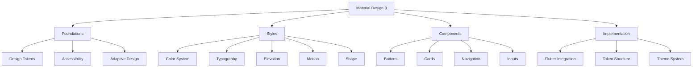

# Material Design 3 - Documentation

> **Material Design 3** is Google's latest design system, based on design tokens and adaptive principles to create inclusive and expressive digital experiences.

## 🎯 Overview

This documentation covers the **partial implementation** of Material Design 3 in Flutter, focusing on the systems that are currently active and functional.

## ⚠️ Implementation Status

### ✅ **Fully Implemented & Active**
- **Typography System** - Complete 15-level type scale
- **Spacing System** - Complete 4dp grid system
- **Elevation System** - 6 elevation levels with shadows
- **Shape System** - Complete corner radius system
- **Motion System** - Duration and easing tokens
- **Breakpoint System** - Responsive design utilities
- **Accessibility Utilities** - Comprehensive WCAG support
- **Adaptive Design** - Complete responsive patterns
- **Color Utilities** - Color manipulation tools

### ❌ **Not Currently Active** (Commented Out)
- **Reference Color Tokens** - Base color palettes
- **System Color Tokens** - Semantic color roles
- **Component Tokens** - Button and other component specs
- **Material 3 Color Schemes** - M3 color generation

### 🔄 **Planned for Future Implementation**
- Full color system activation
- Component token system
- Advanced component specifications

## 🏗️ System Architecture

## 📚 Documentation Structure

### 🏗️ [[foundations/Foundations|Foundations]] - Fundamentals
The fundamental pillars that support the entire system:

- **[[foundations/Design Tokens|Design Tokens]]** - Hierarchical token system (ref/sys/comp)
- **[[foundations/Accessibility|Accessibility]]** - WCAG accessibility features
- **[[foundations/Adaptive Design|Adaptive Design]]** - Responsive and adaptive design

### 🎨 [[styles/Styles|Styles]] - Visual Elements
The visual elements that define appearance:

- **[[styles/Color System|Color System]]** - ❌ *Currently not active - planned for future*
- **[[styles/Typography|Typography]]** - ✅ *Fully implemented and active*
- **[[styles/Elevation|Elevation]]** - ✅ *Fully implemented and active*
- **[[styles/Motion|Motion]]** - ✅ *Fully implemented and active*
- **[[styles/Shape|Shape]]** - ✅ *Fully implemented and active*

### 🧩 [[components/Components|Components]] - UI Components
Practical implementations of UI elements:

- **[[components/Buttons|Buttons]]** - ❌ *Component tokens not active - planned for future*
- **[[components/Cards|Cards]]** - ❌ *Not yet implemented*
- **[[components/Navigation|Navigation]]** - ✅ *Adaptive navigation patterns available*
- **[[components/Inputs|Inputs]]** - ❌ *Not yet implemented*

### ⚙️ [[implementation/Implementation|Implementation]] - Integration Guide
How to use and integrate the system:

- **[[implementation/Flutter Integration|Flutter Integration]]** - Flutter/Material integration
- **[[implementation/Token Structure|Token Structure]]** - Token structure ref/sys/comp
- **[[implementation/Theme System|Theme System]]** - Theme system
- **[[implementation/Best Practices|Best Practices]]** - Best practices

## 🗺️ Navigation Maps

### [[maps/Component Map|🗺️ Component Map]]
Complete visualization of all components and their connections.

### [[maps/Token Map|🏷️ Token Map]]
Complete hierarchy of design tokens and their relationships.

### [[maps/Implementation Map|⚙️ Implementation Map]]
Implementation guide with practical examples.

## 🔗 Important External Links

### Official Documentation
- **[Material Design 3](https://m3.material.io/)** - Official M3 website
- **[M3 Foundations](https://m3.material.io/foundations)** - System foundations
- **[M3 Styles](https://m3.material.io/styles)** - Styles and tokens
- **[M3 Components](https://m3.material.io/components)** - Official components

### Flutter/Material
- **[Flutter Material](https://api.flutter.dev/flutter/material/material-library.html)** - Flutter Material library
- **[Material 3 Flutter](https://docs.flutter.dev/ui/design/material)** - M3 in Flutter
- **[Theme Data](https://api.flutter.dev/flutter/material/ThemeData-class.html)** - Theme system

## 🚀 How to Navigate

1. **Start with [[foundations/Foundations|Foundations]]** to understand base concepts
2. **Explore [[styles/Styles|Styles]]** to learn about visual elements
3. **Check [[components/Components|Components]]** for practical implementations
4. **Consult [[implementation/Implementation|Implementation]]** for integrations
5. **Use [[maps/Component Map|Maps]]** to visualize connections

## 🏷️ Main Tags

#material-design-3 #flutter #design-system #tokens #accessibility #responsive

---

**📌 Note:** This documentation is a living project and is continuously updated with the latest Material Design 3 specifications and Flutter best practices.