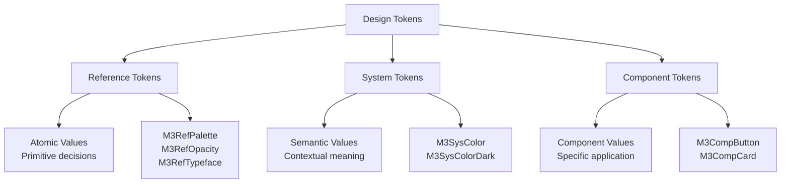
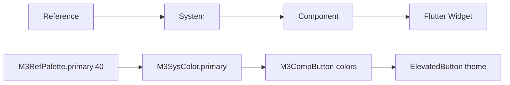

# Design Tokens - Fundamental Value System

> **Design Tokens** are named entities that store visual design attributes, serving as the atomic foundation for the entire Material Design 3 system.

## ⚠️ Current Implementation Status

### ✅ **Active & Working Systems**

- **Typography Tokens** - Complete type scale system
- **Spacing Tokens** - 4dp grid system (space4 to space128)
- **Elevation Tokens** - 6 elevation levels with shadows
- **Shape Tokens** - Corner radius system
- **Motion Tokens** - Duration and easing curves
- **State Tokens** - Interaction opacity states
- **Breakpoint Tokens** - Responsive design utilities

### ❌ **Currently Not Active** (Commented Out)

- **M3RefPalette** - Color palettes system
- **M3RefOpacity** - Reference opacity values
- **M3RefTypeface** - Reference typography specs
- **M3SysColor** - Semantic color roles
- **M3CompButton** - Component specifications

### 🔄 **Planned Implementation**

- Full color system activation
- Component token completion
- Reference token activation

## 🎯 Core Concept

Design tokens replace hard-coded values with a hierarchical and semantic system that enables:

- **🔄 Consistency** - Unified values across the entire application
- **📈 Scalability** - Easy maintenance and expansion
- **🎨 Customization** - Systematic brand personalization
- **♿ Accessibility** - Automatic compliance with standards

## 🏗️ Hierarchical Architecture

Material Design 3 organizes tokens into three hierarchical levels:



### Reference Tokens (Ref) - ❌ **NOT CURRENTLY ACTIVE**

> **⚠️ Warning:** All reference tokens are currently commented out in the implementation. The examples below show the planned architecture but are not functional.

#### 🎨 M3RefPalette - ❌ **Commented Out**

```dart
// ❌ This code is not currently active
// Color palettes with 13 tones (0-100)
/*
static const Map<int, Color> primary = {
  0: Color(0xFF000000),
  10: Color(0xFF21005D),
  20: Color(0xFF381E72),
  40: Color(0xFF6750A4),  // ← Default primary color
  80: Color(0xFFD0BCFF),
  100: Color(0xFFFFFFFF),
};
*/

// ❌ Usage (not functional)
// final primaryColor = M3RefPalette.getColor(M3RefPalette.primary, 40);
```

#### 🌫️ M3RefOpacity - ❌ **Commented Out**

```dart
// ❌ This code is not currently active
/*
static const double hover = 0.08;
static const double focus = 0.12;
static const double pressed = 0.16;
static const double disabled = 0.38;
*/

// ❌ Usage (not functional)
// final hoverOverlay = baseColor.withValues(alpha:M3RefOpacity.hover);
```

#### ✏️ M3RefTypeface - ❌ **Commented Out**

```dart
// ❌ This code is not currently active
/*
static const String brand = 'Roboto';
static const int labelWeight = 500;
static const int bodyWeight = 400;
*/

// ❌ Usage (not functional)
// final fontFamily = M3RefTypeface.brand;
```

### System Tokens (Sys) - ⚖️ **MIXED IMPLEMENTATION**

**Semantic values** that map reference tokens to specific design intentions.

#### 🎨 M3SysColor & M3SysColorDark - ❌ **Commented Out**

```dart
// ❌ Color system is not currently active
/*
class M3SysColor {
  static Color get primary => M3RefPalette.getColor(M3RefPalette.primary, 40);
  static Color get primaryContainer => M3RefPalette.getColor(M3RefPalette.primary, 90);
  static Color get onPrimaryContainer => M3RefPalette.getColor(M3RefPalette.primary, 10);

  static ColorScheme toColorScheme() => ColorScheme.light(
    primary: primary,
    primaryContainer: primaryContainer,
    onPrimaryContainer: onPrimaryContainer,
  );
}
*/
```

#### ✅ **ACTIVE System Tokens**

**Typography System** - Fully functional:

```dart
// ✅ Active and working
class M3TextStyleToken {
  static const TextStyle displayLarge = TextStyle(
    fontSize: 57,
    fontWeight: FontWeight.w400,
    letterSpacing: -0.25,
    height: 1.12,
  );

  static const TextStyle headlineMedium = TextStyle(
    fontSize: 28,
    fontWeight: FontWeight.w400,
    letterSpacing: 0,
    height: 1.29,
  );
  // ... 15 complete text styles
}
```

**Spacing System** - Fully functional:

```dart
// ✅ Active and working
enum M3SpacingToken {
  space4(4.0),
  space8(8.0),
  space16(16.0),
  space24(24.0),
  space32(32.0),
  // ... up to space128

  const M3SpacingToken(this.value);
  final double value;
}
```

**Elevation System** - Fully functional:

```dart
// ✅ Active and working
enum M3Elevation {
  level0(0.0),
  level1(1.0),
  level2(3.0),
  level3(6.0),
  level4(8.0),
  level5(12.0);

  const M3Elevation(this.value);
  final double value;
}
```

### Component Tokens (Comp) - ❌ **NOT CURRENTLY ACTIVE**

> **⚠️ Warning:** All component tokens are currently commented out. The examples below show planned architecture but are not functional.

#### 🔘 M3CompButton - ❌ **Commented Out**

```dart
// ❌ This code is not currently active
/*
abstract class M3CompButton {
  // Heights
  static const double heightSmall = 32.0;
  static const double heightMedium = 40.0;
  static const double heightLarge = 48.0;

  // Shapes
  static const BorderRadius shapeSmall = BorderRadius.all(Radius.circular(8.0));
  static const BorderRadius shapeMedium = BorderRadius.all(Radius.circular(12.0));

  // Elevations
  static const double elevationRested = 1.0;
  static const double elevationHover = 3.0;
  static const double elevationPressed = 1.0;

  // Padding
  static const EdgeInsets paddingMedium = EdgeInsets.symmetric(
    horizontal: 16.0,
    vertical: 8.0,
  );
}
*/

// ❌ Usage (not functional)
/*
ElevatedButton(
  style: ElevatedButton.styleFrom(
    minimumSize: Size.fromHeight(M3CompButton.heightMedium),
    padding: M3CompButton.paddingMedium,
    shape: RoundedRectangleBorder(borderRadius: M3CompButton.shapeMedium),
  ),
  child: Text('Button'),
)
*/
```

#### ✅ **Alternative: Use Active Tokens**

While component tokens aren't active, you can use the working system tokens:

```dart
// ✅ Working alternative using active tokens
ElevatedButton(
  style: ElevatedButton.styleFrom(
    minimumSize: Size.fromHeight(40.0), // Direct value
    padding: EdgeInsets.symmetric(
      horizontal: M3SpacingToken.space16.value, // ✅ Active spacing
    ),
    shape: RoundedRectangleBorder(
      borderRadius: M3ShapeToken.medium.value, // ✅ Active shape
    ),
    elevation: M3ElevationToken.level1.value, // ✅ Active elevation
  ),
  child: Text('Button'),
)
```

## 🗂️ File Structure

```
lib/src/m3/tokens/
├── ref/                    # Reference Tokens
│   ├── color/
│   │   ├── m3_ref_palette.dart
│   │   └── m3_ref_opacity.dart
│   ├── typography/
│   │   └── m3_ref_typeface.dart
│   └── motion/
│       └── m3_ref_duration.dart
├── sys/                    # System Tokens
│   └── color/
│       └── m3_sys_color.dart
└── comp/                   # Component Tokens
    ├── button/
    │   └── m3_comp_button.dart
    └── card/
        └── m3_comp_card.dart
```

## 🔄 Dependency Flow



## 🛠️ Practical Implementation

### Creating New Tokens

#### 1. Reference Token

```dart
// m3_ref_spacing.dart
abstract class M3RefSpacing {
  static const double base = 4.0;
  static const double scale2x = 8.0;
  static const double scale4x = 16.0;
}
```

#### 2. System Token

```dart
// m3_sys_spacing.dart
abstract class M3SysSpacing {
  static double get small => M3RefSpacing.scale2x;   // 8dp
  static double get medium => M3RefSpacing.scale4x;  // 16dp
  static double get large => M3RefSpacing.scale4x * 1.5; // 24dp
}
```

#### 3. Component Token

```dart
// m3_comp_card.dart
abstract class M3CompCard {
  static double get padding => M3SysSpacing.medium;
  static double get margin => M3SysSpacing.small;
  static BorderRadius get shape => BorderRadius.circular(12.0);
}
```

### Integrating with Flutter Theme - ✅ **Using Active Tokens**

> **⚠️ Note:** Since color and component tokens are not active, use the working token systems:

```dart
// theme_builder.dart - Using active tokens only
ThemeData buildM3Theme() {
  return ThemeData(
    useMaterial3: true,
    // ❌ colorScheme: M3SysColor.toColorScheme(), // Not active

    // ✅ Use active typography tokens
    textTheme: TextTheme(
      displayLarge: M3TextStyleToken.displayLarge,
      headlineMedium: M3TextStyleToken.headlineMedium,
      bodyLarge: M3TextStyleToken.bodyLarge,
      // ... other text styles
    ),

    // ✅ Use active token systems for components
    elevatedButtonTheme: ElevatedButtonThemeData(
      style: ElevatedButton.styleFrom(
        minimumSize: Size.fromHeight(40.0),
        shape: RoundedRectangleBorder(
          borderRadius: M3ShapeToken.medium.value, // ✅ Active shape token
        ),
        elevation: M3ElevationToken.level1.value, // ✅ Active elevation token
      ),
    ),
  );
}
```

## 📱 Showcase Example

See practical implementation in **[[../examples/Design Tokens Page|DesignTokensPage]]**:

```dart
// Spacing tokens demonstration
_buildSpacingDemo('M3SpacingToken.space16', M3SpacingToken.space16);

// Density demonstration
_buildDensityDemo('Standard', M3VisualDensityToken.standard);

// Breakpoints demonstration
_buildBreakpointDemo('M3BreakpointToken.medium', M3BreakpointToken.medium);
```

## 🔗 Connections

### To [[../styles/Styles|Styles]]

- **[[../styles/Color System]]** uses **M3RefPalette** and **M3SysColor**
- **[[../styles/Typography]]** uses **M3RefTypeface**
- **[[../styles/Motion]]** uses **M3RefDuration**

### To [[../components/Components|Components]]

- **[[../components/Buttons]]** uses **M3CompButton**
- **[[../components/Cards]]** uses elevation and shape tokens
- **[[../components/Navigation]]** uses adaptive tokens

### To [[../implementation/Implementation|Implementation]]

- **[[../implementation/Token Structure]]** - How to organize tokens
- **[[../implementation/Flutter Integration]]** - How to integrate with Flutter
- **[[../implementation/Theme System]]** - How to use in themes

## 🏷️ Tags

#design-tokens #reference-tokens #system-tokens #component-tokens #m3-foundations #flutter-integration

## 🔍 See Also

- **[[Foundations|🏗️ Foundations]]**
- **[[../styles/Color System|🎨 Color System]]**
- **[[../implementation/Token Structure|⚙️ Token Structure]]**
- **[[../maps/Token Map|🗺️ Token Map]]**

---

**📝 Last Updated:** Partial implementation - Typography, Spacing, Elevation, Shape, Motion systems active. Color and Component systems planned for future releases.
