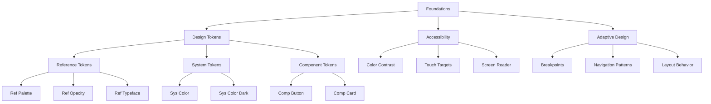

# Foundations - Material Design 3 Fundamentals

> **Foundations** are the fundamental pillars that support the entire Material Design 3 system, providing the conceptual and technical foundation for consistent and accessible implementation.

## 🎯 Overview

The foundations establish central principles that ensure:
- **Consistency** - Unified experience across all platforms
- **Accessibility** - Inclusion for all users
- **Adaptability** - Functionality in different contexts and devices
- **Scalability** - System that grows with needs

## 🏗️ Foundation Components

### [[Design Tokens|🏷️ Design Tokens]]
Hierarchical system of values that defines fundamental properties:

- **[[Design Tokens#Reference Tokens|Reference Tokens]]** - Base atomic values
- **[[Design Tokens#System Tokens|System Tokens]]** - Contextual semantic values  
- **[[Design Tokens#Component Tokens|Component Tokens]]** - Component-specific values

**Flutter Implementation:**
```dart
// Reference tokens - base values
final primaryColor = M3RefPalette.getColor(M3RefPalette.primary, 40);

// System tokens - semantic
final containerColor = M3SysColor.primaryContainer;

// Component tokens - specific
final buttonHeight = M3CompButton.heightMedium;
```

### [[Accessibility|♿ Accessibility]]
Accessibility features following WCAG standards:

- **[[Accessibility#Color Contrast|Color Contrast]]** - Minimum contrast ratios
- **[[Accessibility#Touch Targets|Touch Targets]]** - Minimum accessible sizes
- **[[Accessibility#Screen Readers|Screen Readers]]** - Screen reader support
- **[[Accessibility#Keyboard Navigation|Keyboard Navigation]]** - Keyboard accessibility

**Implementation Example:**
```dart
// Automatic contrast checking
final hasGoodContrast = M3Accessibility.meetsContrastRequirement(
  foreground: textColor,
  background: backgroundColor,
);

// Minimum touch targets
final accessibleButton = M3Accessibility.ensureMinimumTouchTarget(
  child: IconButton(...),
);
```

### [[Adaptive Design|📱 Adaptive Design]]
Responsive design that adapts to different contexts:

- **[[Adaptive Design#Breakpoints|Breakpoints]]** - Responsive breakpoints
- **[[Adaptive Design#Navigation Patterns|Navigation Patterns]]** - Adaptive navigation
- **[[Adaptive Design#Layout Behavior|Layout Behavior]]** - Flexible layouts
- **[[Adaptive Design#Input Methods|Input Methods]]** - Touch/mouse adaptation

**Adaptive Implementation:**
```dart
// Navigation that adapts to screen size
M3AdaptiveScaffold(
  destinations: destinations,
  body: content,
  // Automatically chooses NavigationBar, Rail, or Drawer
);

// Responsive values
final columns = M3Adaptive.responsiveValue<int>(
  context: context,
  compact: 1,    // Mobile
  medium: 2,     // Tablet  
  expanded: 3,   // Desktop
);
```

## 🔗 Connections to Other Systems

### To [[../styles/Styles|Styles]]
Foundations provide the base tokens used by styles:

- **[[Design Tokens]]** → **[[../styles/Color System|Color System]]**
- **[[Design Tokens]]** → **[[../styles/Typography|Typography]]**
- **[[Adaptive Design]]** → **[[../styles/Motion|Motion]]**

### To [[../components/Components|Components]]
Foundation principles are applied to all components:

- **[[Accessibility]]** → **[[../components/Buttons|Buttons]]**
- **[[Adaptive Design]]** → **[[../components/Navigation|Navigation]]**
- **[[Design Tokens]]** → **[[../components/Cards|Cards]]**

### To [[../implementation/Implementation|Implementation]]
Foundations define how to implement the system:

- **[[Design Tokens]]** → **[[../implementation/Token Structure|Token Structure]]**
- **[[Accessibility]]** → **[[../implementation/Best Practices|Best Practices]]**

## 📊 Hierarchy Diagram



## 🏷️ Tags

#foundations #design-tokens #accessibility #adaptive-design #material-design-3 #flutter

## 🔍 See Also

- **[[../Material Design 3|🏠 Material Design 3 Home]]**
- **[[../styles/Styles|🎨 Styles]]**
- **[[../components/Components|🧩 Components]]**
- **[[../maps/Token Map|🗺️ Token Map]]**

---

**📝 Last Updated:** Structure reorganized following official M3 standards