# 🗺️ Component Map - Material Design 3 Component Map

> **Component Map** visualizes all connections between tokens, styles, components and implementations in the Material Design 3 system.

## 🎯 System Overview

This map shows how all elements connect from fundamental tokens to functional Flutter components.

## 🏗️ Complete System Architecture

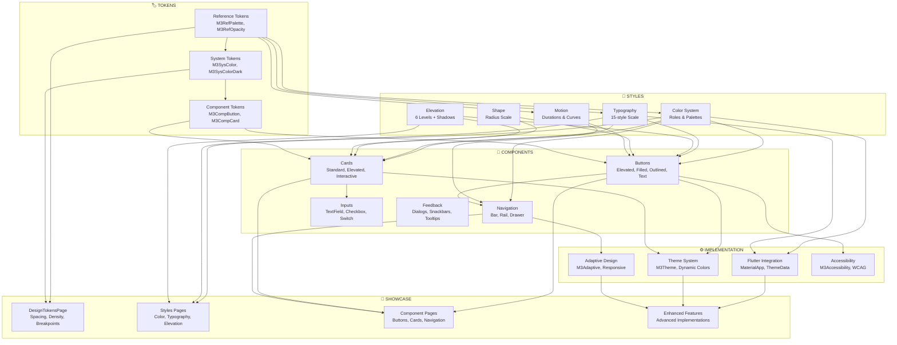

## 🔄 Detailed Connection Flows

### 1. 🏷️ Token-to-Style Flow

#### Color Flow

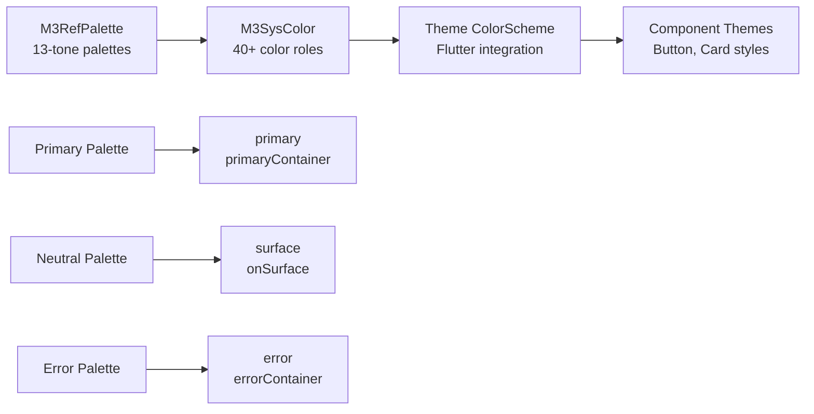

#### Typography Flow

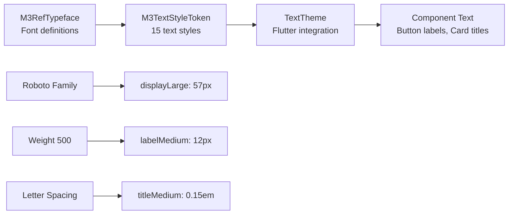

### 2. 🎨 Style-to-Component Flow

#### Button Construction

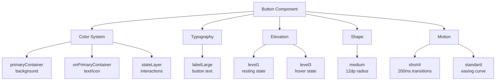

#### Card Construction

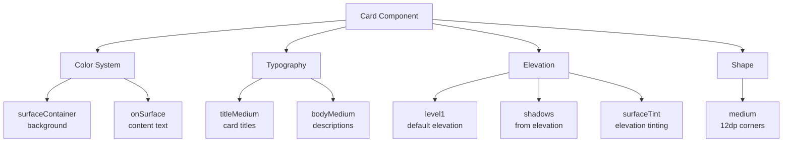

### 3. 🧩 Component Ecosystem

#### Navigation System

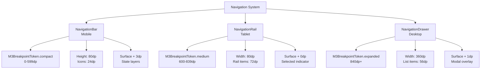

#### Input Components

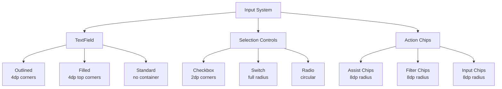

## 📱 Showcase Implementation Connections

### [[../examples/Design Tokens Page|DesignTokensPage]] Connections

```dart
// Spacing demonstration connects to:
M3SpacingToken.space16 ← M3RefSpacing.base * 4 ← 4dp grid system

// Density demonstration connects to:
M3VisualDensityToken.standard ← Platform detection ← Adaptive behavior

// Breakpoint demonstration connects to:
M3BreakpointToken.medium ← MediaQuery.size.width ← Responsive layout
```

### [[../examples/Enhanced Features Page|EnhancedFeaturesPage]] Connections

```dart
// Advanced typography connects to:
M3TextStyleToken.responsiveDisplay(context) ← M3BreakpointToken ← Screen adaptation

// Interactive elevation connects to:
M3SurfaceTint.surfaceAt(context, elevation) ← M3RefPalette ← Surface tinting

// Motion patterns connect to:
M3MotionUtils.fadeIn(duration, curve) ← M3RefDuration ← Animation timing
```

### Adaptive Layout Connections

```dart
// M3AdaptiveScaffold connects to:
M3ScreenSize ← M3BreakpointToken ← MediaQuery
NavigationDestination ← Component tokens ← Visual consistency

// Responsive values connect to:
M3Adaptive.responsiveValue<T>() ← Context ← Screen size classes
```

## 🛠️ Implementation Integration Map

### Theme System Integration

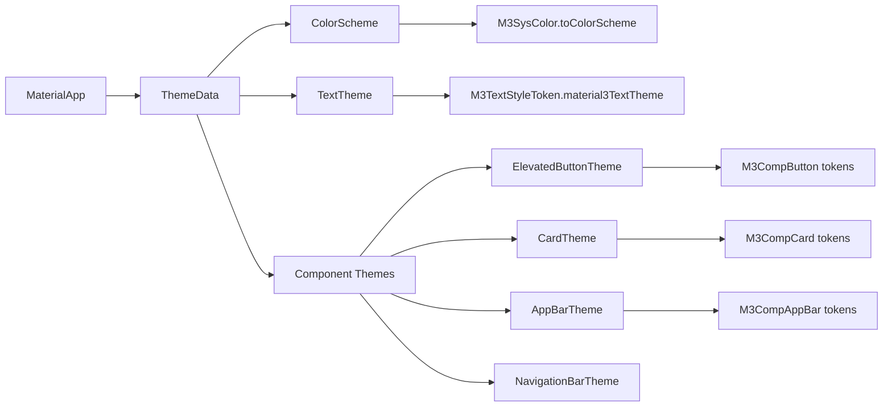

### Accessibility Integration

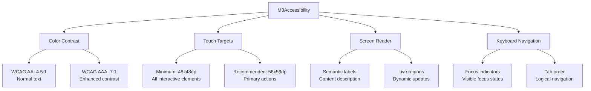

## 📊 Component Usage Statistics

### Most Used Components (from Showcase)

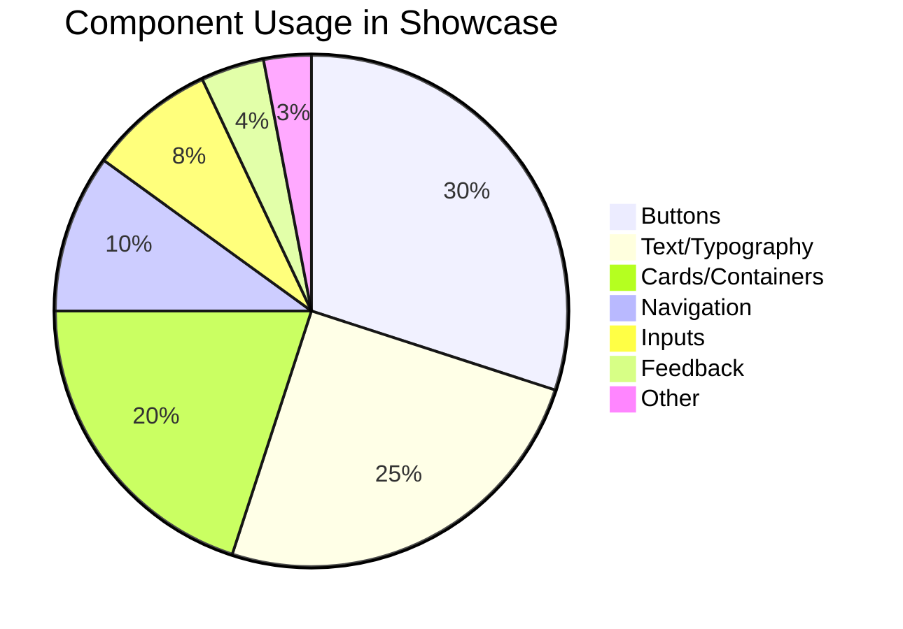

### Token Application Distribution

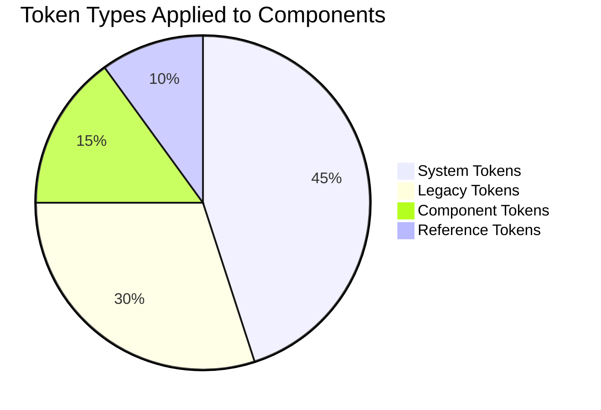

## 🔗 Cross-Reference Network

### Foundation-Style-Component Links

**[[../foundations/Design Tokens|Design Tokens]]** →

- **[[../styles/Color System|Color System]]** → **Button colors**
- **[[../styles/Typography|Typography]]** → **Text styles**
- **[[../styles/Elevation|Elevation]]** → **Card shadows**

**[[../foundations/Accessibility|Accessibility]]** →

- **Button touch targets** → **48dp minimum**
- **Color contrast** → **4.5:1 ratio**
- **Focus indicators** → **Visible outlines**

**[[../foundations/Adaptive Design|Adaptive Design]]** →

- **Navigation patterns** → **Bar/Rail/Drawer**
- **Layout behavior** → **Responsive grids**
- **Input methods** → **Touch/Mouse sizing**

### Implementation-Component Links

**[[../implementation/Flutter Integration|Flutter Integration]]** →

- **MaterialApp setup** → **ThemeData configuration**
- **Widget integration** → **Component tokens**
- **Theme builder** → **M3Theme utility**

**[[../implementation/Theme System|Theme System]]** →

- **Light/Dark themes** → **Color system**
- **Dynamic colors** → **Material You**
- **Component themes** → **Token application**

## 🏷️ Tags

#component-map #material-design-3 #system-architecture #token-flow #style-integration #implementation-guide

## 🔍 See Also

- **[[../Material Design 3|🏠 Material Design 3 Home]]**
- **[[Token Map|🏷️ Token Map]]**
- **[[Implementation Map|⚙️ Implementation Map]]**
- **[[../foundations/Foundations|🏗️ Foundations]]**
- **[[../styles/Styles|🎨 Styles]]**

---

**📝 Last Updated:** Complete map with all connections between tokens, styles, components and implementations
