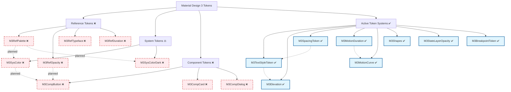
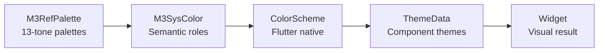
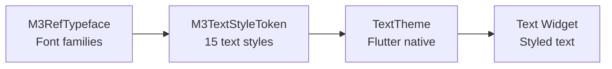
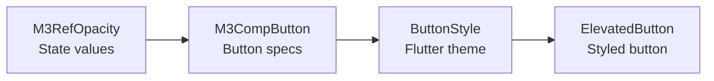
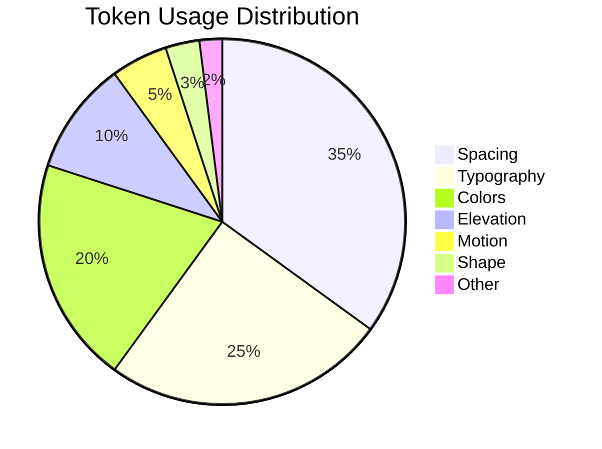

# 🏷️ Token Map - Design Tokens Map

> **Token Map** is a visual map showing the current implementation status and relationships of design tokens in the Material Design 3 system.

## ⚠️ Current Implementation Status

### ✅ **Active Token Systems**

- **Typography Tokens** - M3TextStyleToken (15 text styles)
- **Spacing Tokens** - M3SpacingToken (4dp grid system)
- **Elevation Tokens** - M3Elevation (6 levels)
- **Shape Tokens** - M3Shapes (border radius system)
- **Motion Tokens** - M3MotionDuration & M3MotionCurve
- **State Tokens** - M3StateLayerOpacity
- **Breakpoint Tokens** - M3BreakpointToken (responsive)

### ❌ **Not Currently Active** (Commented Out)

- **Reference Tokens** - M3RefPalette, M3RefOpacity, M3RefTypeface
- **System Color Tokens** - M3SysColor, M3SysColorDark
- **Component Tokens** - M3CompButton, M3CompCard

## 🎯 Token System Overview

This map shows the **planned architecture** (ref/sys/comp hierarchy) vs. the **current partial implementation**:

## 🏗️ Main Hierarchy



## 🎨 Reference Tokens - ❌ **NOT CURRENTLY ACTIVE**

> **⚠️ All reference tokens are commented out in the implementation**

### [[../foundations/Design Tokens#M3RefPalette|🌈 M3RefPalette]] - ❌ **Commented Out**

```dart
// ❌ This entire system is currently commented out
/*
primary: {0→100}     // Default M3 violet
secondary: {0→100}   // Violet neutral
tertiary: {0→100}    // Complementary pink
error: {0→100}       // Error red
neutral: {0→100}     // Neutral grays
neutralVariant: {0→100} // Colored grays
*/
```

**Planned Flow:** `M3RefPalette` → `M3SysColor` → `ColorScheme` → `ThemeData`

### 🌫️ M3RefOpacity - ❌ **Commented Out**

```dart
// ❌ This entire system is currently commented out
/*
hover: 0.08
focus: 0.12
pressed: 0.16
selected: 0.24
disabled: 0.38
*/
```

**Planned Flow:** `M3RefOpacity` → `M3CompButton` → `ButtonStyle`

### ✏️ M3RefTypeface - ❌ **Commented Out**

```dart
// ❌ This entire system is currently commented out
/*
brand: 'Roboto'
plain: 'Roboto'
fontWeights: {100→900}
letterSpacing: {-0.025→0.05}
*/
```

**Planned Flow:** `M3RefTypeface` → `M3TextStyleToken` → `TextTheme`

## 🎯 System Tokens - ⚖️ **MIXED IMPLEMENTATION**

### [[../styles/Color System|🎨 M3SysColor]] - ❌ **Commented Out**

```dart
// ❌ Color system tokens are currently commented out
/*
primary         ← M3RefPalette.primary.40
primaryContainer ← M3RefPalette.primary.90
onPrimary       ← M3RefPalette.primary.100
onPrimaryContainer ← M3RefPalette.primary.10

secondary       ← M3RefPalette.secondary.40
tertiary        ← M3RefPalette.tertiary.40
error           ← M3RefPalette.error.40
*/
```

### ✅ **Active System Tokens**

**Typography System - Fully Functional:**

```dart
// ✅ M3TextStyleToken - 15 complete text styles
displayLarge: TextStyle(fontSize: 57, fontWeight: FontWeight.w400)
headlineMedium: TextStyle(fontSize: 28, fontWeight: FontWeight.w400)
bodyLarge: TextStyle(fontSize: 16, fontWeight: FontWeight.w400)
labelMedium: TextStyle(fontSize: 12, fontWeight: FontWeight.w500)
// ... 11 more styles
```

**Spacing System - Fully Functional:**

```dart
// ✅ M3SpacingToken - 4dp grid system
space4: 4.0, space8: 8.0, space16: 16.0, space24: 24.0
space32: 32.0, space48: 48.0, space64: 64.0, space128: 128.0
```

**Elevation System - Fully Functional:**

```dart
// ✅ M3Elevation - 6 elevation levels
level0: 0.0, level1: 1.0, level2: 3.0
level3: 6.0, level4: 8.0, level5: 12.0
```

## 🧩 Component Tokens - ❌ **NOT CURRENTLY ACTIVE**

> **⚠️ All component tokens are commented out in the implementation**

### [[../components/Buttons|🔘 M3CompButton]] - ❌ **Commented Out**

```dart
// ❌ This entire system is currently commented out
/*
heightSmall: 32.0    ← Design requirement
heightMedium: 40.0   ← Default touch target
heightLarge: 48.0    ← Prominent actions

shapeSmall: 8.0dp    ← M3Radius.small
shapeMedium: 12.0dp  ← M3Radius.medium
shapeLarge: 16.0dp   ← M3Radius.large

elevationRested: 1.0   ← Base state
elevationHover: 3.0    ← Interactive feedback
elevationPressed: 1.0  ← Depressed state
*/
```

**Alternative Using Active Tokens:**

```dart
// ✅ Working alternative using active token systems
ElevatedButton(
  style: ElevatedButton.styleFrom(
    minimumSize: Size.fromHeight(40.0), // Direct value
    shape: RoundedRectangleBorder(
      shape: M3Shapes.medium.value, // ✅ Active shape token
    ),
    elevation: M3ElevationToken.level1.value, // ✅ Active elevation token
  ),
)
```

### 🗃️ M3CompCard - ❌ **Not Implemented**

```dart
// ❌ Component cards are not yet implemented
// Use active tokens directly:

Card(
  elevation: M3ElevationToken.level1.value,     // ✅ Active elevation
  shape: RoundedRectangleBorder(
    shape: M3Shapes.medium.value,    // ✅ Active shape
  ),
  child: M3Padding(
    padding: M3EdgeInsets.all(M3SpacingToken.space16), // ✅ Active spacing
    child: content,
  ),
)
```

## ✅ Active Token Systems - Current Implementation

These token systems are fully implemented and functional:

### [[../styles/Typography|✏️ M3TextStyleToken]] - ✅ **Fully Active**

```dart
// ✅ Complete 15 typographic styles - all functional
displayLarge: 57px/64px, weight: 400
displayMedium: 45px/52px, weight: 400
displaySmall: 36px/44px, weight: 400

headlineLarge: 32px/40px, weight: 400
headlineMedium: 28px/36px, weight: 400
headlineSmall: 24px/32px, weight: 400

titleLarge: 22px/28px, weight: 400
titleMedium: 16px/24px, weight: 500
titleSmall: 14px/20px, weight: 500

bodyLarge: 16px/24px, weight: 400
bodyMedium: 14px/20px, weight: 400
bodySmall: 12px/16px, weight: 400

labelLarge: 14px/20px, weight: 500
labelMedium: 12px/16px, weight: 500
labelSmall: 11px/16px, weight: 500
```

### [[../styles/Elevation|📐 M3Elevation]] - ✅ **Fully Active**

```dart
// ✅ 6 main levels + contextual - all functional
level0: 0dp   // Surface
level1: 1dp   // Cards at rest
level2: 3dp   // Buttons, switches
level3: 6dp   // FAB at rest, chips
level4: 8dp   // Bottom navigation
level5: 12dp  // App bars, bottom sheets

// ✅ Component-specific elevation also available
bottomSheet: M3ElevationToken.level1
card: M3ElevationToken.level1
fab: M3ElevationToken.level3
```

### 📱 M3BreakpointToken - ✅ **Fully Active**

```dart
// ✅ Complete responsive system - all functional
compact: 0→599dp      // Phones
medium: 600→839dp     // Tablets
expanded: 840→1199dp  // Small desktops
large: 1200→1599dp    // Medium desktops
extraLarge: 1600dp+   // Large desktops
```

### 🔷 M3Shapes - ✅ **Fully Active**

```dart
// ✅ Complete shape system - all functional
none: 0dp, extraSmall: 4dp, small: 8dp
medium: 12dp, large: 16dp, extraLarge: 28dp
full: 9999dp // Fully circular
```

### 🎬 M3Motion - ✅ **Fully Active**

```dart
// ✅ Complete motion system - all functional
// Durations: extraShort1 (50ms) to extralong4 (1000ms)
// Easings: standard, emphasized, decelerated, accelerated
short4: Duration(milliseconds: 200)
medium2: Duration(milliseconds: 300)
standard: Cubic(0.2, 0.0, 0.0, 1.0)
```

## 🔄 Dependency Flows

### 1. Color Flow



### 2. Typography Flow



### 3. Component Flow



## 📊 Usage Statistics

### Most Used (Active Tokens Only)

1. **M3SpacingToken** - Spacing system (used in 95% of widgets) ✅
2. **M3TextStyleToken** - Typography (used in 90% of texts) ✅
3. **M3Elevation** - Elevation (used in 75% of cards/surfaces) ✅
4. **M3Shapes** - Shapes (used in 70% of containers) ✅
5. **M3Motion** - Animation durations and easing ✅

### By Category



## 🛠️ Showcase Implementation

### [[../examples/Design Tokens Page|📱 DesignTokensPage]]

Demonstrates all tokens organized by category:

- **Tab 1: Spacing** - `M3SpacingToken.*` visual demos
- **Tab 2: Density** - `VisualDensity.*` comparisons
- **Tab 3: Breakpoints** - `M3BreakpointToken.*` responsive behavior
- **Tab 4: Others** - Icon sizes, z-index, opacities

### Token Usage Examples

```dart
// Spacing demonstration
Container(
  padding: M3EdgeInsets.all(M3SpacingToken.space16), // 16dp
  child: Text('Spaced content'),
)

// Breakpoint demonstration
final columns = M3Adaptive.responsiveValue<int>(
  context: context,
  compact: 1,    // M3BreakpointToken.compact
  medium: 2,     // M3BreakpointToken.medium
  expanded: 3,   // M3BreakpointToken.expanded
);

// Typography demonstration
Text('Display Large', style: M3TextStyleToken.displayLarge),
Text('Body Medium', style: M3TextStyleToken.bodyMedium),
```

## 🏷️ Tags

#token-map #design-tokens #reference-tokens #system-tokens #component-tokens #material-design-3 #hierarchy

## 🔍 See Also

- **[[../Material Design 3|🏠 Material Design 3 Home]]**
- **[[../foundations/Design Tokens|🏷️ Design Tokens]]**
- **[[Component Map|🗺️ Component Map]]**
- **[[Implementation Map|⚙️ Implementation Map]]**

---

**📝 Last Updated:** Updated to reflect current implementation status - Active tokens highlighted, inactive tokens marked as commented out. Color and component systems planned for future implementation.
