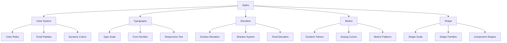
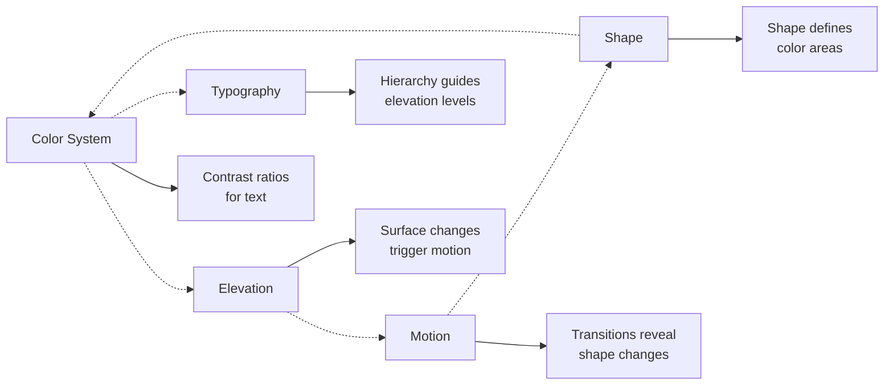

# Styles - Material Design 3 Visual Elements

> **Styles** define the fundamental visual elements that create the visual identity of Material Design 3, transforming abstract tokens into tangible visual properties.

## ⚠️ Implementation Status Overview

### ✅ **Fully Implemented & Active**

- **✏️ Typography** - Complete 15-level type scale system
- **📐 Elevation** - 6 elevation levels with shadows and tinting
- **🎬 Motion** - Duration and easing curve tokens
- **🔷 Shape** - Complete border radius system
- **📊 Spacing** - 4dp grid spacing system
- **🔄 State Layers** - Interaction opacity system

### ❌ **Not Currently Active**

- **🎨 Color System** - Reference palettes and semantic roles
- **🌈 Dynamic Colors** - Material You integration
- **🎨 Tonal Elevation** - Color-based elevation

### 🔄 **Planned for Future Implementation**

- Full M3 color system activation
- Dynamic color support
- Advanced tonal elevation

## 🏗️ Styles System



## 🎨 Color System - ❌ **NOT CURRENTLY ACTIVE**

> **⚠️ Warning:** The complete M3 color system is currently commented out in the implementation. The examples below show planned architecture but are not functional.

### [[Color System|🌈 Color System]] - ❌ **Planned for Future**

Based on **M3RefPalette** (currently not active), the color system would offer:

**Color Roles** - ❌ **Not Functional:**

```dart
// ❌ This code is currently commented out
/*
Container(
  color: M3SysColor.primaryContainer,
  child: Text(
    'Primary Container',
    style: TextStyle(color: M3SysColor.onPrimaryContainer),
  ),
)
*/
```

**Alternative - Use Flutter's Material 3:**

```dart
// ✅ Working alternative using Flutter's built-in M3 colors
ThemeData(
  useMaterial3: true,
  colorSchemeSeed: Colors.blue, // Flutter generates M3 colors
)

// Access colors via theme
Container(
  color: Theme.of(context).colorScheme.primaryContainer,
  child: Text(
    'Primary Container',
    style: TextStyle(
      color: Theme.of(context).colorScheme.onPrimaryContainer,
    ),
  ),
)
```

## ✏️ Typography - ✅ **FULLY IMPLEMENTED & ACTIVE**

### [[Typography|📝 Typographic System]] - ✅ **Working**

Based on Material Design 3's **15-style scale** - fully implemented and functional:

**Type Scale Hierarchy:**

```dart
// Display - Large and prominent text
Text('Display Large', style: M3TypeScaleToken.displayLarge),   // 57px
Text('Display Medium', style: M3TypeScaleToken.displayMedium), // 45px
Text('Display Small', style: M3TypeScaleToken.displaySmall),   // 36px

// Headlines - High emphasis
Text('Headline Large', style: M3TypeScaleToken.headlineLarge), // 32px
Text('Headline Medium', style: M3TypeScaleToken.headlineMedium), // 28px
Text('Headline Small', style: M3TypeScaleToken.headlineSmall), // 24px

// Titles - Medium emphasis
Text('Title Large', style: M3TypeScaleToken.titleLarge),       // 22px
Text('Title Medium', style: M3TypeScaleToken.titleMedium),     // 16px
Text('Title Small', style: M3TypeScaleToken.titleSmall),       // 14px

// Body - Content reading
Text('Body Large', style: M3TypeScaleToken.bodyLarge),         // 16px
Text('Body Medium', style: M3TypeScaleToken.bodyMedium),       // 14px
Text('Body Small', style: M3TypeScaleToken.bodySmall),         // 12px

// Labels - UI and captions
Text('Label Large', style: M3TypeScaleToken.labelLarge),       // 14px
Text('Label Medium', style: M3TypeScaleToken.labelMedium),     // 12px
Text('Label Small', style: M3TypeScaleToken.labelSmall),       // 11px
```

**Responsive Typography:**

```dart
// Typography that adapts to screen size
Text(
  'Responsive Title',
  style: M3TypeScaleToken.responsiveDisplay(context),
)

// Text with enhanced readability
Text(
  'Enhanced Readability',
  style: M3TypeScaleToken.enhancedReadability(M3TypeScaleToken.bodyLarge),
)
```

## 📐 Elevation - ✅ **FULLY IMPLEMENTED & ACTIVE**

### [[Elevation|🏔️ Elevation System]] - ✅ **Working**

Depth system based on **6 main levels** - fully implemented and functional:

**Elevation Levels:**

```dart
abstract class M3Elevation {
  static const M3ElevationProfile level0 = M3ElevationProfile(dp: 0);   // Surface
  static const M3ElevationProfile level1 = M3ElevationProfile(dp: 1);   // Cards
  static const M3ElevationProfile level2 = M3ElevationProfile(dp: 3);   // Buttons
  static const M3ElevationProfile level3 = M3ElevationProfile(dp: 6);   // FAB, Chips
  static const M3ElevationProfile level4 = M3ElevationProfile(dp: 8);   // Navigation Bar
  static const M3ElevationProfile level5 = M3ElevationProfile(dp: 12);  // App Bar
}
```

**Surface Tinting:**

```dart
// Surface with elevation-based color
Container(
  decoration: BoxDecoration(
    color: M3TonalColor.surfaceAt(context, 6.0),
    boxShadow: M3ShadowToken.fromElevation(6.0),
  ),
  child: content,
)
```

**Interactive Elevation:**

```dart
// Elevation that responds to interactions
AnimatedContainer(
  duration: M3MotionDurationToken.short4,
  decoration: BoxDecoration(
    color: M3TonalColor.surfaceAt(context, isPressed ? 1.0 : 3.0),
    boxShadow: M3ShadowToken.fromElevation(isPressed ? 1.0 : 3.0),
  ),
)
```

## 🎬 Motion - ✅ **FULLY IMPLEMENTED & ACTIVE**

### [[Motion|🌊 Motion System]] - ✅ **Working**

Based on **M3MotionDurationToken** and **M3MotionEasingToken** tokens - fully implemented and functional:

**Duration Categories:**

```dart
// Micro-interactions
M3MotionDurationToken.extraShort1  // 50ms
M3MotionDurationToken.short4       // 200ms

// Standard transitions
M3MotionDurationToken.medium1      // 250ms - most common
M3MotionDurationToken.medium2      // 300ms - emphasis

// Complex animations
M3MotionDurationToken.long1        // 450ms
M3MotionDurationToken.long4        // 600ms
```

**Easing Curves:**

```dart
// Official M3 curves
M3MotionEasingToken.standard       // (0.2, 0.0, 0.0, 1.0) - most common
M3MotionEasingToken.emphasized     // (0.05, 0.7, 0.1, 1.0) - important transitions
M3MotionEasingToken.decelerated    // (0.0, 0.0, 0.2, 1.0) - entering elements
M3MotionEasingToken.accelerated    // (0.3, 0.0, 1.0, 1.0) - exiting elements
```

**Motion Patterns:**

```dart
// Fade with contextual duration
M3MotionUtils.fadeIn(
  duration: M3MotionDurationToken.medium2,
  curve: M3MotionEasingToken.emphasizedDecelerate,
  child: myWidget,
)

// Combined slide and fade
M3MotionUtils.slideAndFade(
  slideOffset: const Offset(0, 30),
  child: myWidget,
)
```

## 🔷 Shape - ✅ **FULLY IMPLEMENTED & ACTIVE**

### [[Shape|💎 Shape System]] - ✅ **Working**

System based on **progressive border radius** - fully implemented and functional:

**Shape Scale:**

```dart
abstract class M3Radius {
  static const double none = 0;           // 0dp - square
  static const double extraSmall = 4.0;   // 4dp - subtle
  static const double small = 8.0;        // 8dp - soft
  static const double medium = 12.0;      // 12dp - standard
  static const double large = 16.0;       // 16dp - prominent
  static const double extraLarge = 28.0;  // 28dp - very rounded
  static const double full = 9999.0;      // fully circular
}
```

**Shape Utilities:**

```dart
// Basic shapes
Container(
  decoration: BoxDecoration(
    borderRadius: M3ShapeUtils.rounded(M3Radius.medium), // 12dp
  ),
)

// Directional shapes
Container(
  decoration: BoxDecoration(
    borderRadius: M3ShapeUtils.topRounded(M3Radius.large), // Top only
  ),
)

// Component-specific shapes
Card(
  shape: RoundedRectangleBorder(
    borderRadius: BorderRadius.circular(M3Radius.medium), // 12dp for cards
  ),
)
```

## 🔗 Connections Between Styles



## 🛠️ Integrated Implementation

### Theme Integration

```dart
ThemeData buildM3Theme({Color? seedColor}) {
  final colorScheme = M3SysColor.toColorScheme();

  return ThemeData(
    useMaterial3: true,
    colorScheme: colorScheme,
    textTheme: M3TypeScaleToken.material3TextTheme,
    elevatedButtonTheme: ElevatedButtonThemeData(
      style: ElevatedButton.styleFrom(
        elevation: M3ElevationToken.level1.value,
        shape: RoundedRectangleBorder(
          borderRadius: BorderRadius.circular(M3Radius.medium),
        ),
        animationDuration: M3MotionDurationToken.short4,
      ),
    ),
  );
}
```

### Component Styling

```dart
// Card using all styles
Card(
  // Shape
  shape: RoundedRectangleBorder(
    borderRadius: BorderRadius.circular(M3Radius.medium),
  ),
  // Elevation
  elevation: M3ElevationToken.level1.value,
  // Color (automatic via theme)
  child: AnimatedContainer(
    // Motion
    duration: M3MotionDurationToken.short4,
    curve: M3MotionEasingToken.standard,
    padding: EdgeInsets.all(M3SpacingToken.space16),
    child: Column(
      children: [
        // Typography
        Text('Title', style: M3TypeScaleToken.titleMedium),
        Text('Description', style: M3TypeScaleToken.bodyMedium),
      ],
    ),
  ),
)
```

## 🏷️ Tags

#styles #color-system #typography #elevation #motion #shape #material-design-3 #visual-design

## 🔍 See Also

- **[[../foundations/Foundations|🏗️ Foundations]]**
- **[[../components/Components|🧩 Components]]**
- **[[../implementation/Theme System|⚙️ Theme System]]**
- **[[../maps/Component Map|🗺️ Component Map]]**

---

**📝 Last Updated:** Integrated system with all 5 M3 styles pillars
