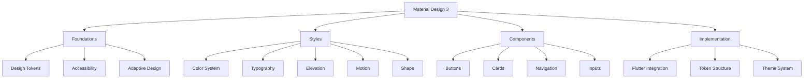

# Material Design 3 - Documentação

> **Material Design 3** é o sistema de design mais recente do Google, baseado em tokens de design e princípios adaptativos para criar experiências digitais inclusivas e expressivas.

## 🎯 Visão Geral

Esta documentação cobre a **implementação parcial** do Material Design 3 em Flutter, focando nos sistemas que estão atualmente ativos e funcionais.

## ⚠️ Status da Implementação

### ✅ **Totalmente Implementado e Ativo**
- **Sistema de Tipografia** - Escala tipográfica completa de 15 níveis
- **Sistema de Espaçamento** - Sistema completo de grid 4dp
- **Sistema de Elevação** - 6 níveis de elevação com sombras
- **Sistema de Formas** - Sistema completo de raio de borda
- **Sistema de Movimento** - Tokens de duração e easing
- **Sistema de Breakpoints** - Utilitários de design responsivo
- **Utilitários de Acessibilidade** - Suporte abrangente WCAG
- **Design Adaptativo** - Padrões responsivos completos
- **Utilitários de Cor** - Ferramentas de manipulação de cores

### ❌ **Atualmente Não Ativo** (Comentado)
- **Tokens de Cor de Referência** - Paletas de cores base
- **Tokens de Cor do Sistema** - Papéis semânticos de cor
- **Tokens de Componentes** - Especificações de botões e outros componentes
- **Esquemas de Cor Material 3** - Geração de cores M3

### 🔄 **Planejado para Implementação Futura**
- Ativação completa do sistema de cores
- Sistema de tokens de componentes
- Especificações avançadas de componentes

## 🏗️ Arquitetura do Sistema

## 📚 Estrutura da Documentação

### 🏗️ [[Foundations|Foundations]] - Fundamentos
Os pilares fundamentais que sustentam todo o sistema:

- **[[Design Tokens|Design Tokens]]** - Sistema hierárquico de tokens (ref/sys/comp)
- **[[foundations/Accessibility|Accessibility]]** - Recursos de acessibilidade WCAG
- **[[foundations/Adaptive Design|Adaptive Design]]** - Design responsivo e adaptativo

### 🎨 [[Styles|Styles]] - Estilos
Os elementos visuais que definem a aparência:

- **[[styles/Color System|Color System]]** - ❌ *Atualmente não ativo - planejado para o futuro*
- **[[styles/Typography|Typography]]** - ✅ *Totalmente implementado e ativo*
- **[[styles/Elevation|Elevation]]** - ✅ *Totalmente implementado e ativo*
- **[[styles/Motion|Motion]]** - ✅ *Totalmente implementado e ativo*
- **[[styles/Shape|Shape]]** - ✅ *Totalmente implementado e ativo*

### 🧩 [[components/Components|Components]] - Componentes
Implementações práticas dos elementos de UI:

- **[[components/Buttons|Buttons]]** - ❌ *Tokens de componentes não ativos - planejado para o futuro*
- **[[components/Cards|Cards]]** - ❌ *Ainda não implementado*
- **[[components/Navigation|Navigation]]** - ✅ *Padrões de navegação adaptativa disponíveis*
- **[[components/Inputs|Inputs]]** - ❌ *Ainda não implementado*

### ⚙️ [[Implementation|Implementation]] - Implementação
Como usar e integrar o sistema:

- **[[implementation/Flutter Integration|Flutter Integration]]** - Integração com Flutter/Material
- **[[implementation/Token Structure|Token Structure]]** - Estrutura de tokens ref/sys/comp
- **[[implementation/Theme System|Theme System]]** - Sistema de temas
- **[[implementation/Best Practices|Best Practices]]** - Boas práticas

## 🗺️ Mapas de Navegação

### [[Component Map|🗺️ Mapa de Componentes]]
Visualização completa de todos os componentes e suas conexões.

### [[Token Map|🏷️ Mapa de Tokens]]
Hierarquia completa dos design tokens e suas relações.

### [[Implementation Map|⚙️ Mapa de Implementação]]
Guia de implementação com exemplos práticos.

## 🔗 Links Externos Importantes

### Documentação Oficial
- **[Material Design 3](https://m3.material.io/)** - Site oficial do M3
- **[M3 Foundations](https://m3.material.io/foundations)** - Fundamentos do sistema
- **[M3 Styles](https://m3.material.io/styles)** - Estilos e tokens
- **[M3 Components](https://m3.material.io/components)** - Componentes oficiais

### Flutter/Material
- **[Flutter Material](https://api.flutter.dev/flutter/material/material-library.html)** - Biblioteca Material Flutter
- **[Material 3 Flutter](https://docs.flutter.dev/ui/design/material)** - M3 no Flutter
- **[Theme Data](https://api.flutter.dev/flutter/material/ThemeData-class.html)** - Sistema de temas

## 🚀 Como Navegar

1. **Comece pelos [[Foundations|Foundations]]** para entender os conceitos base
2. **Explore os [[Styles|Styles]]** para conhecer os elementos visuais
3. **Veja os [[components/Components|Components]]** para implementações práticas
4. **Consulte [[Implementation|Implementation]]** para integrações
5. **Use os [[Component Map|Mapas]]** para visualizar conexões

## 🏷️ Tags Principais

#material-design-3 #flutter #design-system #tokens #accessibility #responsive

---

**📌 Nota:** Esta documentação é um projeto vivo e é atualizada continuamente com as especificações mais recentes do Material Design 3 e melhores práticas do Flutter.