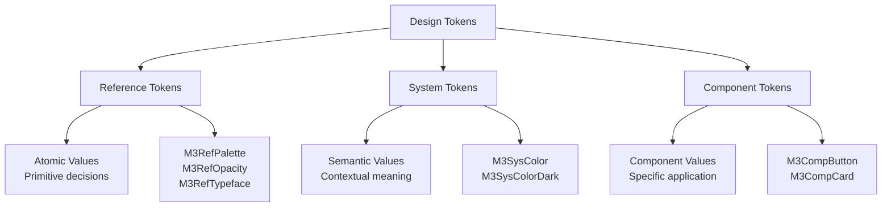
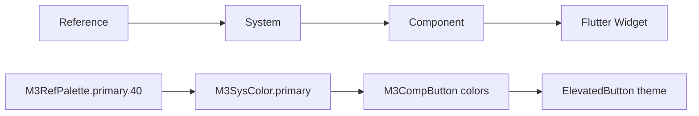

# Design Tokens - Sistema de Valores Fundamentais

> **Design Tokens** são entidades nomeadas que armazenam atributos de design visual, servindo como a base atômica para todo o sistema Material Design 3.

## 🎯 Conceito Central

Design tokens substituem valores hard-coded por um sistema hierárquico e semântico que permite:

- **🔄 Consistência** - Valores unificados em toda a aplicação
- **📈 Escalabilidade** - Fácil manutenção e expansão
- **🎨 Customização** - Personalização sistemática da marca
- **♿ Acessibilidade** - Conformidade automática com padrões

## 🏗️ Arquitetura Hierárquica

O Material Design 3 organiza tokens em três níveis hierárquicos:



### Reference Tokens (Ref)

**Valores atômicos fundamentais** que definem as decisões básicas de design.

#### [[../implementation/Flutter Integration#M3RefPalette|🎨 M3RefPalette]]

```dart
// Paletas de cores com 13 tons (0-100)
static const Map<int, Color> primary = {
  0: Color(0xFF000000),
  10: Color(0xFF21005D),
  20: Color(0xFF381E72),
  40: Color(0xFF6750A4),  // ← Cor primária padrão
  80: Color(0xFFD0BCFF),
  100: Color(0xFFFFFFFF),
};

// Uso
final primaryColor = M3RefPalette.getColor(M3RefPalette.primary, 40);
```

#### 🌫️ M3RefOpacity

```dart
// Opacidades fundamentais para estados
static const double hover = 0.08;
static const double focus = 0.12;
static const double pressed = 0.16;
static const double disabled = 0.38;

// Uso
final hoverOverlay = baseColor.withValues(alpha:M3RefOpacity.hover);
```

#### ✏️ M3RefTypeface

```dart
// Definições tipográficas fundamentais
static const String brand = 'Roboto';
static const int labelWeight = 500;
static const int bodyWeight = 400;

// Uso
final fontFamily = M3RefTypeface.brand;
```

### System Tokens (Sys)

**Valores semânticos** que mapeiam reference tokens para intenções específicas de design.

#### [[../styles/Color System|🎨 M3SysColor]] & M3SysColorDark

```dart
// Light theme colors
class M3SysColor {
  static Color get primary => M3RefPalette.getColor(M3RefPalette.primary, 40);
  static Color get primaryContainer => M3RefPalette.getColor(M3RefPalette.primary, 90);
  static Color get onPrimaryContainer => M3RefPalette.getColor(M3RefPalette.primary, 10);

  // Conversão para Flutter ColorScheme
  static ColorScheme toColorScheme() => ColorScheme.light(
    primary: primary,
    primaryContainer: primaryContainer,
    onPrimaryContainer: onPrimaryContainer,
    // ... outros roles
  );
}

// Dark theme colors
class M3SysColorDark {
  static Color get primary => M3RefPalette.getColor(M3RefPalette.primary, 80);
  // ... versões escuras
}
```

### Component Tokens (Comp)

**Valores específicos** para componentes individuais, definindo suas características precisas.

#### [[../components/Buttons|🔘 M3CompButton]]

```dart
abstract class M3CompButton {
  // Alturas
  static const double heightSmall = 32.0;
  static const double heightMedium = 40.0;
  static const double heightLarge = 48.0;

  // Formas
  static const BorderRadius shapeSmall = BorderRadius.all(Radius.circular(8.0));
  static const BorderRadius shapeMedium = BorderRadius.all(Radius.circular(12.0));

  // Elevações
  static const double elevationRested = 1.0;
  static const double elevationHover = 3.0;
  static const double elevationPressed = 1.0;

  // Padding
  static const M3EdgeInsets paddingMedium = M3EdgeInsets.symmetric(
    horizontal: 16.0,
    vertical: 8.0,
  );
}

// Uso em componente
ElevatedButton(
  style: ElevatedButton.styleFrom(
    minimumSize: Size.fromHeight(M3CompButton.heightMedium),
    padding: M3CompButton.paddingMedium,
    shape: RoundedRectangleBorder(borderRadius: M3CompButton.shapeMedium),
  ),
  child: Text('Button'),
)
```

## 🗂️ Estrutura de Arquivos

```
lib/src/m3/tokens/
├── ref/                    # Reference Tokens
│   ├── color/
│   │   ├── m3_ref_palette.dart
│   │   └── m3_ref_opacity.dart
│   ├── typography/
│   │   └── m3_ref_typeface.dart
│   └── motion/
│       └── m3_ref_duration.dart
├── sys/                    # System Tokens
│   └── color/
│       └── m3_sys_color.dart
└── comp/                   # Component Tokens
    ├── button/
    │   └── m3_comp_button.dart
    └── card/
        └── m3_comp_card.dart
```

## 🔄 Fluxo de Dependências



## 🛠️ Implementação Prática

### Criando Novos Tokens

#### 1. Reference Token

```dart
// m3_ref_spacing.dart
abstract class M3RefSpacing {
  static const double base = 4.0;
  static const double scale2x = 8.0;
  static const double scale4x = 16.0;
}
```

#### 2. System Token

```dart
// m3_sys_spacing.dart
abstract class M3SysSpacing {
  static double get small => M3RefSpacing.scale2x;   // 8dp
  static double get medium => M3RefSpacing.scale4x;  // 16dp
  static double get large => M3RefSpacing.scale4x * 1.5; // 24dp
}
```

#### 3. Component Token

```dart
// m3_comp_card.dart
abstract class M3CompCard {
  static double get padding => M3SysSpacing.medium;
  static double get margin => M3SysSpacing.small;
  static BorderRadius get shape => BorderRadius.circular(12.0);
}
```

### Integrando com Flutter Theme

```dart
// theme_builder.dart
ThemeData buildM3Theme() {
  return ThemeData(
    useMaterial3: true,
    colorScheme: M3SysColor.toColorScheme(),
    elevatedButtonTheme: ElevatedButtonThemeData(
      style: ElevatedButton.styleFrom(
        minimumSize: Size.fromHeight(M3CompButton.heightMedium),
        shape: RoundedRectangleBorder(
          borderRadius: M3CompButton.shapeMedium,
        ),
      ),
    ),
  );
}
```

## 📱 Exemplo de Showcase

Veja a implementação prática em **[[../examples/Design Tokens Page|DesignTokensPage]]**:

```dart
// Demonstração de spacing tokens
_buildSpacingDemo('M3SpacingToken.space16', M3SpacingToken.space16);

// Demonstração de density
_buildDensityDemo('Standard', M3VisualDensityToken.standard);

// Demonstração de breakpoints
_buildBreakpointDemo('M3BreakpointToken.medium', M3BreakpointToken.medium);
```

## 🔗 Conexões

### Para [[Styles|Styles]]

- **[[../styles/Color System]]** usa **M3RefPalette** e **M3SysColor**
- **[[../styles/Typography]]** usa **M3RefTypeface**
- **[[../styles/Motion]]** usa **M3RefDuration**

### Para [[../components/Components|Components]]

- **[[../components/Buttons]]** usa **M3CompButton**
- **[[../components/Cards]]** usa tokens de elevation e shape
- **[[../components/Navigation]]** usa tokens adaptativos

### Para [[Implementation|Implementation]]

- **[[../implementation/Token Structure]]** - Como organizar tokens
- **[[../implementation/Flutter Integration]]** - Como integrar com Flutter
- **[[../implementation/Theme System]]** - Como usar em temas

## 🏷️ Tags

#design-tokens #reference-tokens #system-tokens #component-tokens #m3-foundations #flutter-integration

## 🔍 Ver Também

- **[[Foundations|🏗️ Foundations]]**
- **[[../styles/Color System|🎨 Color System]]**
- **[[../implementation/Token Structure|⚙️ Token Structure]]**
- **[[Token Map|🗺️ Token Map]]**

---

**📝 Última Atualização:** Implementada hierarquia completa ref/sys/comp seguindo padrões M3
