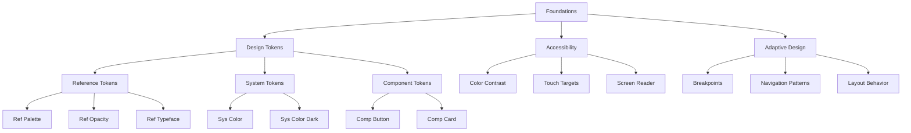

# Foundations - Fundamentos do Material Design 3

> Os **Foundations** são os pilares fundamentais que sustentam todo o sistema Material Design 3, fornecendo a base conceitual e técnica para uma implementação consistente e acessível.

## 🎯 Visão Geral

Os fundamentos estabelecem os princípios centrais que garantem:
- **Consistência** - Experiência unificada em todas as plataformas
- **Acessibilidade** - Inclusão para todos os usuários
- **Adaptabilidade** - Funcionamento em diferentes contextos e dispositivos
- **Escalabilidade** - Sistema que cresce com as necessidades

## 🏗️ Componentes dos Foundations

### [[Design Tokens|🏷️ Design Tokens]]
Sistema hierárquico de valores que define as propriedades fundamentais:

- **[[Design Tokens#Reference Tokens|Reference Tokens]]** - Valores atômicos base
- **[[Design Tokens#System Tokens|System Tokens]]** - Valores semânticos contextuais  
- **[[Design Tokens#Component Tokens|Component Tokens]]** - Valores específicos de componentes

**Implementação Flutter:**
```dart
// Reference tokens - valores base
final primaryColor = M3RefPalette.getColor(M3RefPalette.primary, 40);

// System tokens - semântica
final containerColor = M3SysColor.primaryContainer;

// Component tokens - específicos
final buttonHeight = M3CompButton.heightMedium;
```

### [[Accessibility|♿ Accessibility]]
Recursos de acessibilidade seguindo padrões WCAG:

- **[[Accessibility#Color Contrast|Contraste de Cores]]** - Razões mínimas de contraste
- **[[Accessibility#Touch Targets|Alvos de Toque]]** - Tamanhos mínimos acessíveis
- **[[Accessibility#Screen Readers|Screen Readers]]** - Suporte a leitores de tela
- **[[Accessibility#Keyboard Navigation|Navegação por Teclado]]** - Acessibilidade por teclado

**Exemplo de Implementação:**
```dart
// Verificação automática de contraste
final hasGoodContrast = M3Accessibility.meetsContrastRequirement(
  foreground: textColor,
  background: backgroundColor,
);

// Alvos de toque mínimos
final accessibleButton = M3Accessibility.ensureMinimumTouchTarget(
  child: IconButton(...),
);
```

### [[Adaptive Design|📱 Adaptive Design]]
Design responsivo que se adapta a diferentes contextos:

- **[[Adaptive Design#Breakpoints|Breakpoints]]** - Pontos de quebra responsivos
- **[[Adaptive Design#Navigation Patterns|Padrões de Navegação]]** - Navegação adaptativa
- **[[Adaptive Design#Layout Behavior|Comportamento de Layout]]** - Layouts flexíveis
- **[[Adaptive Design#Input Methods|Métodos de Entrada]]** - Adaptação touch/mouse

**Implementação Adaptativa:**
```dart
// Navegação que se adapta ao tamanho da tela
M3AdaptiveScaffold(
  destinations: destinations,
  body: content,
  // Automaticamente escolhe NavigationBar, Rail ou Drawer
);

// Valores responsivos
final columns = M3Adaptive.responsiveValue<int>(
  context: context,
  compact: 1,    // Mobile
  medium: 2,     // Tablet  
  expanded: 3,   // Desktop
);
```

## 🔗 Conexões com Outros Sistemas

### Para [[Styles|Styles]]
Os foundations fornecem os tokens base que são utilizados pelos styles:

- **[[Design Tokens]]** → **[[../styles/Color System|Color System]]**
- **[[Design Tokens]]** → **[[../styles/Typography|Typography]]**
- **[[Adaptive Design]]** → **[[../styles/Motion|Motion]]**

### Para [[../components/Components|Components]]
Os principles dos foundations são aplicados em todos os componentes:

- **[[Accessibility]]** → **[[../components/Buttons|Buttons]]**
- **[[Adaptive Design]]** → **[[../components/Navigation|Navigation]]**
- **[[Design Tokens]]** → **[[../components/Cards|Cards]]**

### Para [[Implementation|Implementation]]
Os foundations definem como implementar o sistema:

- **[[Design Tokens]]** → **[[../implementation/Token Structure|Token Structure]]**
- **[[Accessibility]]** → **[[../implementation/Best Practices|Best Practices]]**

## 📊 Hierarchy Diagram



## 🏷️ Tags

#foundations #design-tokens #accessibility #adaptive-design #material-design-3 #flutter

## 🔍 Ver Também

- **[[Material Design 3|🏠 Material Design 3 Home]]**
- **[[Styles|🎨 Styles]]**
- **[[../components/Components|🧩 Components]]**
- **[[Token Map|🗺️ Token Map]]**

---

**📝 Última Atualização:** Estrutura reorganizada seguindo padrões oficiais M3