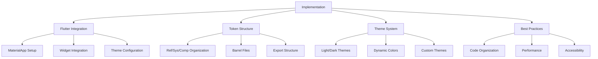

# Implementation - Implementação Prática do Material Design 3

> **Implementation** fornece guias práticos e exemplos concretos de como integrar todo o sistema Material Design 3 em projetos Flutter reais.

## 🎯 Visão Geral

Esta seção cobre todos os aspectos práticos de implementação:

- **🔧 Integração Flutter** - Como usar com Flutter/Material
- **🏗️ Estrutura de Tokens** - Organização prática dos tokens
- **🎨 Sistema de Temas** - Criação e aplicação de temas
- **📋 Melhores Práticas** - Padrões e convenções recomendadas

## 🏗️ Estrutura de Implementação



## 🔧 [[Flutter Integration|Flutter Integration]]

### Setup Básico do MaterialApp

```dart
import 'package:material_design/material_design.dart';

class MyApp extends StatelessWidget {
  @override
  Widget build(BuildContext context) {
    return MaterialApp(
      title: 'Material Design 3 App',
      // Habilitando Material 3
      theme: _buildLightTheme(),
      darkTheme: _buildDarkTheme(),
      themeMode: ThemeMode.system,
      home: const HomePage(),
    );
  }

  ThemeData _buildLightTheme() {
    return ThemeData(
      useMaterial3: true,
      colorScheme: M3SysColor.toColorScheme(),
      textTheme: M3TextStyleToken.material3TextTheme,
      // Configurações automáticas de componentes
      elevatedButtonTheme: ElevatedButtonThemeData(
        style: ElevatedButton.styleFrom(
          minimumSize: Size.fromHeight(M3CompButton.heightMedium),
          shape: RoundedRectangleBorder(
            borderRadius: M3CompButton.shapeMedium,
          ),
        ),
      ),
    );
  }

  ThemeData _buildDarkTheme() {
    return ThemeData(
      useMaterial3: true,
      colorScheme: M3SysColorDark.toColorScheme(),
      textTheme: M3TextStyleToken.material3TextTheme,
    );
  }
}
```

### Usando Tokens em Widgets

```dart
class ExampleCard extends StatelessWidget {
  @override
  Widget build(BuildContext context) {
    return Container(
      // Usando component tokens diretamente
      padding: M3CompCard.padding,
      margin: M3CompCard.margin,
      decoration: BoxDecoration(
        // Usando system colors
        color: M3SysColor.surfaceContainer,
        borderRadius: M3CompCard.shape,
        // Usando elevation system
        boxShadow: M3ShadowToken.fromElevation(M3ElevationToken.level1.value),
      ),
      child: Column(
        children: [
          // Usando typography scale
          Text(
            'Card Title',
            style: M3TextStyleToken.titleMedium.copyWith(
              color: M3SysColor.onSurface,
            ),
          ),
          // Usando spacing tokens
          SizedBox(height: M3SpacingToken.space8),
          Text(
            'Card description text',
            style: M3TextStyleToken.bodyMedium.copyWith(
              color: M3SysColor.onSurfaceVariant,
            ),
          ),
        ],
      ),
    );
  }
}
```

## 🏗️ [[Token Structure|Estrutura de Tokens]]

### Organização de Arquivos

```
lib/src/m3/
├── tokens/
│   ├── ref/                    # Reference Tokens
│   │   ├── ref.dart           # Barrel file
│   │   ├── color/
│   │   │   ├── m3_ref_palette.dart
│   │   │   └── m3_ref_opacity.dart
│   │   ├── typography/
│   │   │   └── m3_ref_typeface.dart
│   │   └── motion/
│   │       └── m3_ref_duration.dart
│   │
│   ├── sys/                    # System Tokens
│   │   ├── sys.dart           # Barrel file
│   │   └── color/
│   │       └── m3_sys_color.dart
│   │
│   ├── comp/                   # Component Tokens
│   │   ├── comp.dart          # Barrel file
│   │   ├── button/
│   │   │   └── m3_comp_button.dart
│   │   └── card/
│   │       └── m3_comp_card.dart
│   │
│   └── tokens.dart            # Main barrel file
│
├── foundations/               # Foundation classes
├── theme/                    # Theme builders
└── m3.dart                   # Main barrel
```

### Barrel Files Strategy

```dart
// tokens/tokens.dart - Exporta tudo
export 'ref/ref.dart';
export 'sys/sys.dart';
export 'comp/comp.dart';
// Legacy tokens para compatibilidade
export 'color/m3_tonal_color.dart';
export 'typography/m3_type_scale.dart';

// ref/ref.dart - Reference tokens
export 'color/m3_ref_palette.dart';
export 'color/m3_ref_opacity.dart';
export 'typography/m3_ref_typeface.dart';
export 'motion/m3_ref_duration.dart';

// sys/sys.dart - System tokens
export 'color/m3_sys_color.dart';

// comp/comp.dart - Component tokens
export 'button/m3_comp_button.dart';
export 'card/m3_comp_card.dart';
```

### Import Strategy

```dart
// Para usuários finais - import único
import 'package:material_design/material_design.dart';

// Para desenvolvimento interno - imports específicos
import 'package:material_design/src/m3/tokens/ref/ref.dart';
import 'package:material_design/src/m3/tokens/sys/sys.dart';
import 'package:material_design/src/m3/tokens/comp/comp.dart';
```

## 🎨 [[Theme System|Sistema de Temas]]

### M3Theme Builder

```dart
class M3Theme {
  /// Constrói tema claro com seed color opcional
  static ThemeData light({
    Color? seedColor,
    M3VisualDensityToken? visualDensity,
  }) {
    final colorScheme = seedColor != null
        ? ColorScheme.fromSeed(seedColor: seedColor, brightness: Brightness.light)
        : M3SysColor.toColorScheme();

    return ThemeData(
      useMaterial3: true,
      brightness: Brightness.light,
      colorScheme: colorScheme,
      visualDensity: visualDensity ?? M3VisualDensityToken.adaptivePlatformDensity.value,

      // Typography
      textTheme: M3TextStyleToken.material3TextTheme,

      // Components
      elevatedButtonTheme: _buildElevatedButtonTheme(colorScheme),
      cardTheme: _buildCardTheme(colorScheme),
      appBarTheme: _buildAppBarTheme(colorScheme),
    );
  }

  /// Constrói tema escuro
  static ThemeData dark({Color? seedColor}) {
    final colorScheme = seedColor != null
        ? ColorScheme.fromSeed(seedColor: seedColor, brightness: Brightness.dark)
        : M3SysColorDark.toColorScheme();

    return light(seedColor: seedColor).copyWith(
      brightness: Brightness.dark,
      colorScheme: colorScheme,
    );
  }

  /// Tema de alto contraste
  static ThemeData highContrast() {
    return light().copyWith(
      // Ajustes de contraste aumentado
      textTheme: M3TextStyleToken.material3TextTheme.apply(
        displayColor: Colors.black,
        bodyColor: Colors.black,
      ),
    );
  }
}

// Helper methods
ElevatedButtonThemeData _buildElevatedButtonTheme(ColorScheme colorScheme) {
  return ElevatedButtonThemeData(
    style: ElevatedButton.styleFrom(
      minimumSize: Size.fromHeight(M3CompButton.heightMedium),
      padding: M3CompButton.paddingMedium,
      shape: RoundedRectangleBorder(
        borderRadius: M3CompButton.shapeMedium,
      ),
      elevation: M3CompButton.elevationRested,
      animationDuration: M3MotionDurationToken.short4,
    ),
  );
}
```

### Dynamic Colors (Material You)

```dart
class DynamicTheme extends StatefulWidget {
  final Widget child;

  const DynamicTheme({Key? key, required this.child}) : super(key: key);

  @override
  State<DynamicTheme> createState() => _DynamicThemeState();
}

class _DynamicThemeState extends State<DynamicTheme> {
  ColorScheme? _dynamicColorScheme;

  @override
  void initState() {
    super.initState();
    _loadDynamicColors();
  }

  Future<void> _loadDynamicColors() async {
    try {
      final corePalette = await DynamicColorPlugin.getCorePalette();
      if (corePalette != null && mounted) {
        setState(() {
          _dynamicColorScheme = corePalette.toColorScheme();
        });
      }
    } catch (e) {
      // Fallback to static colors
      debugPrint('Dynamic colors not available: $e');
    }
  }

  @override
  Widget build(BuildContext context) {
    return MaterialApp(
      theme: M3Theme.light(
        seedColor: _dynamicColorScheme?.primary,
      ),
      darkTheme: M3Theme.dark(
        seedColor: _dynamicColorScheme?.primary,
      ),
      child: widget.child,
    );
  }
}
```

## 📋 [[Best Practices|Melhores Práticas]]

### 1. Organização de Código

```dart
// ✅ Bom - Use tokens semânticos
Container(
  padding: EdgeInsets.all(M3SpacingToken.space16),
  decoration: BoxDecoration(
    color: M3SysColor.primaryContainer,
    borderRadius: BorderRadius.circular(M3Radius.medium),
  ),
)

// ❌ Ruim - Valores hard-coded
Container(
  padding: EdgeInsets.all(16.0),
  decoration: BoxDecoration(
    color: Color(0xFFEADDFF),
    borderRadius: BorderRadius.circular(12.0),
  ),
)

// ✅ Bom - Use component tokens para componentes
ElevatedButton(
  style: ElevatedButton.styleFrom(
    minimumSize: Size.fromHeight(M3CompButton.heightMedium),
    shape: RoundedRectangleBorder(
      borderRadius: M3CompButton.shapeMedium,
    ),
  ),
  child: Text('Button'),
)
```

### 2. Performance

```dart
// ✅ Bom - Cache theme data
class MyWidget extends StatelessWidget {
  @override
  Widget build(BuildContext context) {
    final colorScheme = Theme.of(context).colorScheme;
    final textTheme = Theme.of(context).textTheme;

    return Container(
      color: colorScheme.primaryContainer,
      child: Text('Text', style: textTheme.titleMedium),
    );
  }
}

// ❌ Ruim - Acessos repetidos ao theme
class BadWidget extends StatelessWidget {
  @override
  Widget build(BuildContext context) {
    return Container(
      color: Theme.of(context).colorScheme.primaryContainer,
      child: Text(
        'Text',
        style: Theme.of(context).textTheme.titleMedium,
      ),
    );
  }
}
```

### 3. Acessibilidade

```dart
// ✅ Bom - Use M3Accessibility utilities
Widget accessibleButton = M3Accessibility.ensureMinimumTouchTarget(
  child: IconButton(
    onPressed: onPressed,
    tooltip: 'Accessible button',
    icon: Icon(Icons.add),
  ),
);

// ✅ Bom - Verifique contraste
final hasGoodContrast = M3Accessibility.meetsContrastRequirement(
  foreground: textColor,
  background: backgroundColor,
);

// ✅ Bom - Use semantic labels
Semantics(
  label: 'Primary action button',
  button: true,
  child: ElevatedButton(
    onPressed: onPressed,
    child: Text('Submit'),
  ),
)
```

## 🛠️ Exemplos Práticos

### [[../examples/Complete App Example|App Completo]]

Veja implementação completa em **[[../examples/Showcase App|exemplo/lib/main.dart]]**:

```dart
// main.dart - App principal reorganizado
class TokenShowcaseApp extends StatelessWidget {
  @override
  Widget build(BuildContext context) {
    final themeProvider = Provider.of<ThemeProvider>(context);

    return MaterialApp(
      title: 'Material Design 3',
      theme: M3Theme.light(seedColor: themeProvider.seedColor),
      darkTheme: M3Theme.dark(seedColor: themeProvider.seedColor),
      themeMode: themeProvider.themeMode,
      home: M3AdaptiveScaffold(
        destinations: navigationDestinations,
        body: PageView(children: showcasePages),
      ),
    );
  }
}
```

### [[../examples/Design Tokens Page|Design Tokens Page]]

Página demonstrando tokens em ação:

```dart
// Spacing demonstration
_buildSpacingDemo('M3SpacingToken.space16', M3SpacingToken.space16);

// Density demonstration
_buildDensityDemo('Standard', M3VisualDensityToken.standard);

// Breakpoints demonstration
_buildBreakpointDemo('M3BreakpointToken.medium', M3BreakpointToken.medium);
```

## 🔗 Conexões

### Para [[Foundations|Foundations]]

- **[[Design Tokens]]** → **Token Structure**
- **[[../foundations/Accessibility]]** → **Best Practices**

### Para [[Styles|Styles]]

- **[[../styles/Color System]]** → **Theme System**
- **[[../styles/Typography]]** → **Flutter Integration**

### Para [[../components/Components|Components]]

- **Component Tokens** → **Widget Integration**
- **Theme Configuration** → **Component Styling**

## 🏷️ Tags

#implementation #flutter-integration #theme-system #token-structure #best-practices #material-design-3

## 🔍 Ver Também

- **[[Material Design 3|🏠 Material Design 3 Home]]**
- **[[../examples/Showcase App|📱 Showcase App]]**
- **[[Implementation Map|🗺️ Implementation Map]]**

---

**📝 Última Atualização:** Guias práticos atualizados com nova estrutura de tokens
