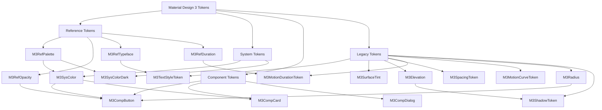
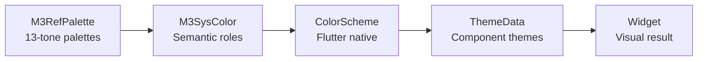
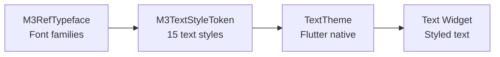
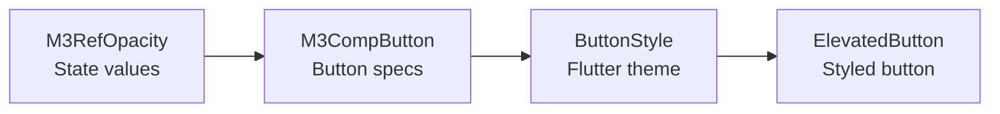
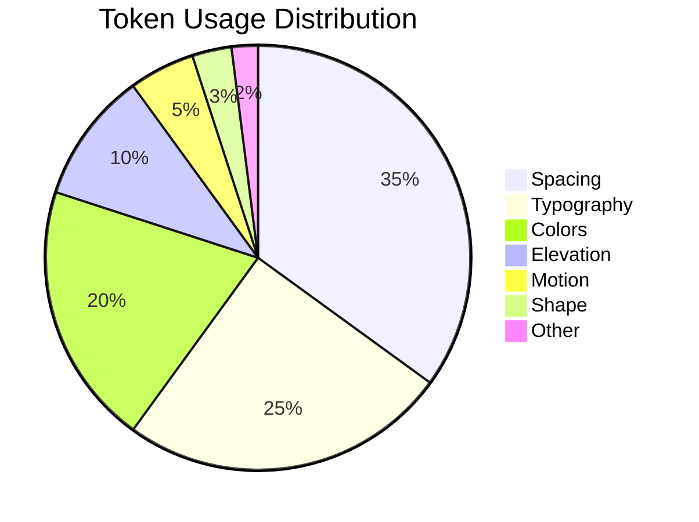

# 🏷️ Token Map - Mapa Completo dos Design Tokens

> **Token Map** é um mapa visual completo que mostra todas as relações e hierarquias dos design tokens no sistema Material Design 3.

## 🎯 Visão Geral do Sistema de Tokens

Este mapa mostra como os tokens fluem desde os valores fundamentais (**Reference**) até implementações específicas (**Component**), passando pela camada semântica (**System**).

## 🏗️ Hierarquia Principal



## 🎨 Reference Tokens - Fundação

### [[Design Tokens#M3RefPalette|🌈 M3RefPalette]]

```dart
// Paletas com 13 tons (0-100)
primary: {0→100}     // Violeta padrão M3
secondary: {0→100}   // Neutro violeta
tertiary: {0→100}    // Rosa complementar
error: {0→100}       // Vermelho de erro
neutral: {0→100}     // Cinzas neutros
neutralVariant: {0→100} // Cinzas coloridos
```

**Fluxo:** `M3RefPalette` → `M3SysColor` → `ColorScheme` → `ThemeData`

### 🌫️ M3RefOpacity

```dart
// Estados de interação
hover: 0.08
focus: 0.12
pressed: 0.16
selected: 0.24
disabled: 0.38

// Superfícies
container: 0.05
overlay: 0.32
scrim: 0.32
```

**Fluxo:** `M3RefOpacity` → `M3CompButton` → `ButtonStyle`

### ✏️ M3RefTypeface

```dart
// Famílias de fonte
brand: 'Roboto'
plain: 'Roboto'
fontWeights: {100→900}
letterSpacing: {-0.025→0.05}
```

**Fluxo:** `M3RefTypeface` → `M3TextStyleToken` → `TextTheme`

### ⏱️ M3RefDuration

```dart
// Categorias de duração
extraShort: 50→200ms    // Micro-interações
short: 250→400ms        // Estado changes
medium: 450→600ms       // Transições padrão
long: 700→1000ms        // Complexas
extraLong: 1200→1800ms  // Página transitions
```

**Fluxo:** `M3RefDuration` → `M3MotionDurationToken` → `AnimationController`

## 🎯 System Tokens - Semântica

### [[../styles/Color System|🎨 M3SysColor]] (Light Theme)

```dart
// Mapeamento semântico do M3RefPalette
primary         ← M3RefPalette.primary.40
primaryContainer ← M3RefPalette.primary.90
onPrimary       ← M3RefPalette.primary.100
onPrimaryContainer ← M3RefPalette.primary.10

secondary       ← M3RefPalette.secondary.40
tertiary        ← M3RefPalette.tertiary.40
error           ← M3RefPalette.error.40

surface         ← M3RefPalette.neutral.99
onSurface       ← M3RefPalette.neutral.10
surfaceContainer ← M3RefPalette.neutral.94
```

### 🌙 M3SysColorDark (Dark Theme)

```dart
// Versão escura com tons invertidos
primary         ← M3RefPalette.primary.80  // Tom mais claro
primaryContainer ← M3RefPalette.primary.30  // Tom mais escuro
onPrimary       ← M3RefPalette.primary.20  // Contraste
onPrimaryContainer ← M3RefPalette.primary.90

surface         ← M3RefPalette.neutral.10  // Superfície escura
onSurface       ← M3RefPalette.neutral.90  // Texto claro
```

**Conversão:** `M3SysColor.toColorScheme()` → `ColorScheme` → `MaterialApp.theme`

## 🧩 Component Tokens - Específicos

### [[../components/Buttons|🔘 M3CompButton]]

```dart
// Dimensões
heightSmall: 32.0    ← Design requirement
heightMedium: 40.0   ← Default touch target
heightLarge: 48.0    ← Prominent actions

// Formas
shapeSmall: 8.0dp    ← M3Radius.small
shapeMedium: 12.0dp  ← M3Radius.medium
shapeLarge: 16.0dp   ← M3Radius.large

// Estados de elevação
elevationRested: 1.0   ← Base state
elevationHover: 3.0    ← Interactive feedback
elevationPressed: 1.0  ← Depressed state

// Opacidades de estado
stateLayerHover ← M3RefOpacity.hover
stateLayerPressed ← M3RefOpacity.pressed
```

**Aplicação:**

```dart
ElevatedButton(
  style: ElevatedButton.styleFrom(
    minimumSize: Size.fromHeight(M3CompButton.heightMedium), // 40dp
    shape: RoundedRectangleBorder(
      shape: M3CompButton.shapeMedium, // 12dp
    ),
    elevation: M3CompButton.elevationRested, // 1dp
  ),
)
```

### 🗃️ M3CompCard

```dart
// Elevação contextual
elevationDefault: M3ElevationToken.level1  // 1dp
elevationHover: M3ElevationToken.level2    // 3dp
elevationDragged: M3ElevationToken.level4  // 8dp

// Forma padrão
shape: M3Radius.medium  // 12dp

// Padding interno
contentPadding: M3SpacingToken.space16  // 16dp
```

## 🔗 Legacy Tokens - Compatibilidade

Tokens existentes mantidos para compatibilidade, gradualmente migrados para nova estrutura:

### [[../styles/Typography|✏️ M3TextStyleToken]]

```dart
// 15 estilos tipográficos
displayLarge: 57px/64px, weight: 400
displayMedium: 45px/52px, weight: 400
displaySmall: 36px/44px, weight: 400

headlineLarge: 32px/40px, weight: 400
headlineMedium: 28px/36px, weight: 400
headlineSmall: 24px/32px, weight: 400

titleLarge: 22px/28px, weight: 400
titleMedium: 16px/24px, weight: 500
titleSmall: 14px/20px, weight: 500

bodyLarge: 16px/24px, weight: 400
bodyMedium: 14px/20px, weight: 400
bodySmall: 12px/16px, weight: 400

labelLarge: 14px/20px, weight: 500
labelMedium: 12px/16px, weight: 500
labelSmall: 11px/16px, weight: 500
```

### [[../styles/Elevation|📐 M3Elevation]]

```dart
// 6 níveis principais + contextuais
level0: 0dp   // Surface
level1: 1dp   // Cards at rest
level2: 3dp   // Buttons, switches
level3: 6dp   // FAB at rest, chips
level4: 8dp   // Bottom navigation
level5: 12dp  // App bars, bottom sheets

// Contextuais
dialog: 24dp
navigationDrawer: 16dp
modal: 16dp
```

### [[../foundations/Adaptive Design#Breakpoints|📱 M3BreakpointToken]]

```dart
// Window size classes
compact: 0→599dp      // Phones
medium: 600→839dp     // Tablets
expanded: 840→1199dp  // Small desktops
large: 1200→1599dp    // Medium desktops
extraLarge: 1600dp+   // Large desktops
```

## 🔄 Fluxos de Dependência

### 1. Color Flow



### 2. Typography Flow



### 3. Component Flow



## 📊 Usage Statistics

### Mais Usados

1. **M3SpacingToken** - Sistema de espaçamento (usado em 95% dos widgets)
2. **M3TextStyleToken** - Tipografia (usado em 90% dos textos)
3. **M3SysColor** - Cores sistemáticas (usado em 85% dos containers)
4. **M3Elevation** - Elevação (usado em 75% dos cards/surfaces)
5. **M3Radius** - Formas (usado em 70% dos containers)

### Por Categoria



## 🛠️ Implementação no Showcase

### [[../examples/Design Tokens Page|📱 DesignTokensPage]]

Demonstra todos os tokens organizados por categoria:

- **Tab 1: Spacing** - `M3SpacingToken.*` visual demos
- **Tab 2: Density** - `M3VisualDensityToken.*` comparisons
- **Tab 3: Breakpoints** - `M3BreakpointToken.*` responsive behavior
- **Tab 4: Others** - Icon sizes, z-index, opacities

### Token Usage Examples

```dart
// Spacing demonstration
Container(
  padding: M3EdgeInsets.all(M3SpacingToken.space16), // 16dp
  child: Text('Spaced content'),
)

// Breakpoint demonstration
final columns = M3Adaptive.responsiveValue<int>(
  context: context,
  compact: 1,    // M3BreakpointToken.compact
  medium: 2,     // M3BreakpointToken.medium
  expanded: 3,   // M3BreakpointToken.expanded
);

// Typography demonstration
Text('Display Large', style: M3TextStyleToken.displayLarge),
Text('Body Medium', style: M3TextStyleToken.bodyMedium),
```

## 🏷️ Tags

#token-map #design-tokens #reference-tokens #system-tokens #component-tokens #material-design-3 #hierarchy

## 🔍 Ver Também

- **[[Material Design 3|🏠 Material Design 3 Home]]**
- **[[Design Tokens|🏷️ Design Tokens]]**
- **[[Component Map|🗺️ Component Map]]**
- **[[Implementation Map|⚙️ Implementation Map]]**

---

**📝 Última Atualização:** Mapa completo com hierarquia ref/sys/comp e fluxos de dependência
