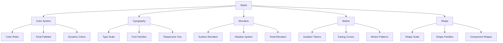
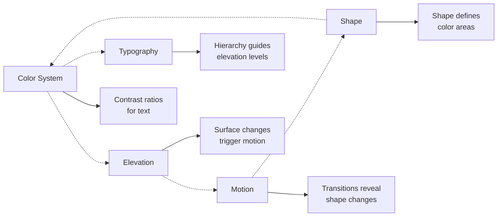

# Styles - Elementos Visuais do Material Design 3

> **Styles** definem os elementos visuais fundamentais que criam a identidade visual do Material Design 3, transformando tokens abstratos em propriedades visuais tangíveis.

## 🎯 Visão Geral

Os styles do M3 fornecem um sistema visual coeso e expressivo através de cinco pilares fundamentais:

- **🎨 Cor** - Sistema de cores harmônico e acessível
- **✏️ Tipografia** - Hierarquia textual clara e legível
- **📐 Elevação** - Profundidade através de sombras e tingimento
- **🎬 Movimento** - Animações naturais e contextuais
- **🔷 Forma** - Sistema de bordas e contornos

## 🏗️ Sistema de Styles



## 🎨 Color System

### [[Color System|🌈 Sistema de Cores Completo]]

Baseado no **[[Design Tokens#M3RefPalette|M3RefPalette]]**, o sistema de cores oferece:

**Color Roles:**

```dart
// Usando M3SysColor
Container(
  color: M3SysColor.primaryContainer,
  child: Text(
    'Primary Container',
    style: TextStyle(color: M3SysColor.onPrimaryContainer),
  ),
)
```

**Tonal Elevation:**

```dart
// Superfícies com tingimento baseado na elevação
Container(
  color: M3SurfaceTint.surfaceAt(context, 3.0), // 3dp elevation
  child: content,
)
```

**Dynamic Colors (Material You):**

```dart
// Cores que se adaptam ao wallpaper do usuário
final colorScheme = await DynamicColorPlugin.getCorePalette();
```

## ✏️ Typography

### [[Typography|📝 Sistema Tipográfico]]

Baseado na **escala de 15 estilos** do Material Design 3:

**Type Scale Hierarchy:**

```dart
// Display - Texto grande e proeminente
Text('Display Large', style: M3TextStyleToken.displayLarge),   // 57px
Text('Display Medium', style: M3TextStyleToken.displayMedium), // 45px
Text('Display Small', style: M3TextStyleToken.displaySmall),   // 36px

// Headlines - Alta ênfase
Text('Headline Large', style: M3TextStyleToken.headlineLarge), // 32px
Text('Headline Medium', style: M3TextStyleToken.headlineMedium), // 28px
Text('Headline Small', style: M3TextStyleToken.headlineSmall), // 24px

// Titles - Média ênfase
Text('Title Large', style: M3TextStyleToken.titleLarge),       // 22px
Text('Title Medium', style: M3TextStyleToken.titleMedium),     // 16px
Text('Title Small', style: M3TextStyleToken.titleSmall),       // 14px

// Body - Leitura de conteúdo
Text('Body Large', style: M3TextStyleToken.bodyLarge),         // 16px
Text('Body Medium', style: M3TextStyleToken.bodyMedium),       // 14px
Text('Body Small', style: M3TextStyleToken.bodySmall),         // 12px

// Labels - UI e legendas
Text('Label Large', style: M3TextStyleToken.labelLarge),       // 14px
Text('Label Medium', style: M3TextStyleToken.labelMedium),     // 12px
Text('Label Small', style: M3TextStyleToken.labelSmall),       // 11px
```

**Responsive Typography:**

```dart
// Tipografia que se adapta ao tamanho da tela
Text(
  'Responsive Title',
  style: M3TextStyleToken.responsiveDisplay(context),
)

// Texto com legibilidade aprimorada
Text(
  'Enhanced Readability',
  style: M3TextStyleToken.enhancedReadability(M3TextStyleToken.bodyLarge),
)
```

## 📐 Elevation

### [[Elevation|🏔️ Sistema de Elevação]]

Sistema de profundidade baseado em **6 níveis principais**:

**Elevation Levels:**

```dart
abstract class M3Elevation {
  static const M3ElevationProfile level0 = M3ElevationProfile(dp: 0);   // Surface
  static const M3ElevationProfile level1 = M3ElevationProfile(dp: 1);   // Cards
  static const M3ElevationProfile level2 = M3ElevationProfile(dp: 3);   // Buttons
  static const M3ElevationProfile level3 = M3ElevationProfile(dp: 6);   // FAB, Chips
  static const M3ElevationProfile level4 = M3ElevationProfile(dp: 8);   // Navigation Bar
  static const M3ElevationProfile level5 = M3ElevationProfile(dp: 12);  // App Bar
}
```

**Surface Tinting:**

```dart
// Superfície com cor baseada na elevação
Container(
  decoration: M3BoxDecoration(
    color: M3SurfaceTint.surfaceAt(context, 6.0),
    boxShadow: M3ElevationShadows.fromElevation(6.0),
  ),
  child: content,
)
```

**Interactive Elevation:**

```dart
// Elevação que responde a interações
AnimatedContainer(
  duration: M3MotionDuration.short4,
  decoration: M3BoxDecoration(
    color: M3SurfaceTint.surfaceAt(context, isPressed ? 1.0 : 3.0),
    boxShadow: M3ElevationShadows.fromElevation(isPressed ? 1.0 : 3.0),
  ),
)
```

## 🎬 Motion

### [[Motion|🌊 Sistema de Movimento]]

Baseado em **[[Design Tokens#M3RefDuration|M3RefDuration]]** e curvas de easing oficiais:

**Duration Categories:**

```dart
// Micro-interações
M3MotionDuration.extraShort1  // 50ms
M3MotionDuration.short4       // 200ms

// Transições padrão
M3MotionDuration.medium1      // 250ms - mais comum
M3MotionDuration.medium2      // 300ms - ênfase

// Animações complexas
M3MotionDuration.long1        // 450ms
M3MotionDuration.long4        // 600ms
```

**Easing Curves:**

```dart
// Curvas oficiais M3
M3MotionCurve.standard       // (0.2, 0.0, 0.0, 1.0) - mais comum
M3MotionCurve.emphasized     // (0.05, 0.7, 0.1, 1.0) - transições importantes
M3MotionCurve.decelerated    // (0.0, 0.0, 0.2, 1.0) - elementos entrando
M3MotionCurve.accelerated    // (0.3, 0.0, 1.0, 1.0) - elementos saindo
```

**Motion Patterns:**

```dart
// Fade com duração contextual
M3MotionUtils.fadeIn(
  duration: M3MotionDuration.medium2,
  curve: M3MotionCurve.emphasizedDecelerate,
  child: myWidget,
)

// Slide e fade combinados
M3MotionUtils.slideAndFade(
  slideOffset: const Offset(0, 30),
  child: myWidget,
)
```

## 🔷 Shape

### [[Shape|💎 Sistema de Formas]]

Sistema baseado em **raio de borda progressivo**:

**Shape Scale:**

```dart
abstract class M3Radius {
  static const double none = 0;           // 0dp - quadrado
  static const double extraSmall = 4.0;   // 4dp - sutil
  static const double small = 8.0;        // 8dp - suave
  static const double medium = 12.0;      // 12dp - padrão
  static const double large = 16.0;       // 16dp - proeminente
  static const double extraLarge = 28.0;  // 28dp - muito arredondado
  static const double full = 9999.0;      // totalmente circular
}
```

**Shape Utilities:**

```dart
// Formas básicas
Container(
  decoration: M3BoxDecoration(
    shape: M3ShapeUtils.rounded(M3Radius.medium), // 12dp
  ),
)

// Formas direcionais
Container(
  decoration: M3BoxDecoration(
    shape: M3ShapeUtils.topRounded(M3Radius.large), // Apenas topo
  ),
)

// Formas de componente específico
Card(
  shape: RoundedRectangleBorder(
    shape: BorderRadius.circular(M3Radius.medium), // 12dp para cards
  ),
)
```

## 🔗 Conexões Entre Styles



## 🛠️ Implementação Integrada

### Theme Integration

```dart
ThemeData buildM3Theme({Color? seedColor}) {
  final colorScheme = M3SysColor.toColorScheme();

  return ThemeData(
    useMaterial3: true,
    colorScheme: colorScheme,
    textTheme: M3TextStyleToken.material3TextTheme,
    elevatedButtonTheme: ElevatedButtonThemeData(
      style: ElevatedButton.styleFrom(
        elevation: M3Elevation.level1.dp,
        shape: RoundedRectangleBorder(
          shape: BorderRadius.circular(M3Radius.medium),
        ),
        animationDuration: M3MotionDuration.short4,
      ),
    ),
  );
}
```

### Component Styling

```dart
// Card usando todos os styles
Card(
  // Shape
  shape: RoundedRectangleBorder(
    shape: BorderRadius.circular(M3Radius.medium),
  ),
  // Elevation
  elevation: M3Elevation.level1.dp,
  // Color (automático via theme)
  child: AnimatedContainer(
    // Motion
    duration: M3MotionDuration.short4,
    curve: M3MotionCurve.standard,
    padding: M3EdgeInsets.all(M3SpacingToken.space16),
    child: Column(
      children: [
        // Typography
        Text('Title', style: M3TextStyleToken.titleMedium),
        Text('Description', style: M3TextStyleToken.bodyMedium),
      ],
    ),
  ),
)
```

## 🏷️ Tags

#styles #color-system #typography #elevation #motion #shape #material-design-3 #visual-design

## 🔍 Ver Também

- **[[Foundations|🏗️ Foundations]]**
- **[[../components/Components|🧩 Components]]**
- **[[../implementation/Theme System|⚙️ Theme System]]**
- **[[Component Map|🗺️ Component Map]]**

---

**📝 Última Atualização:** Sistema integrado com todos os 5 pilares do M3 styles
